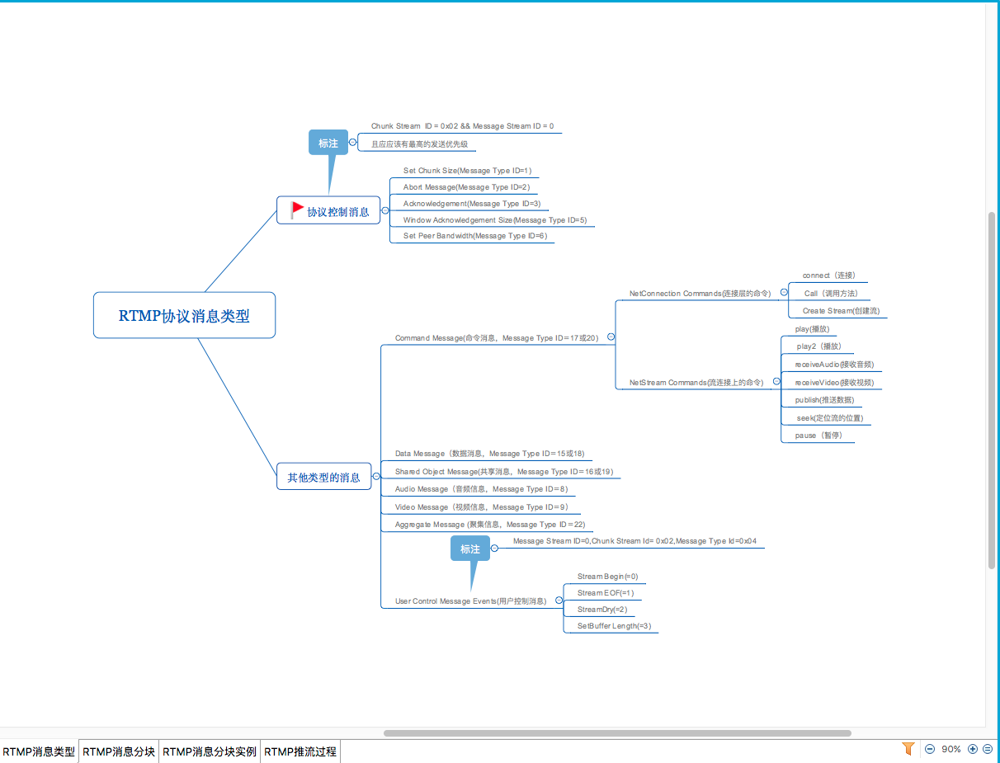

# 音视频基础知识
- [音视频基础知识](#音视频基础知识)
  - [1.音视频系统架构](#1音视频系统架构)
    - [1.1 从日常说起](#11-从日常说起)
    - [1.2 基础概念](#12-基础概念)
    - [1.3 动手试试](#13-动手试试)
  - [2.封装(Mux)/解封装(Demux)](#2封装mux解封装demux)
    - [2.1 主要封装格式](#21-主要封装格式)
    - [2.2 flv封装详解](#22-flv封装详解)
    - [2.3 mp4封装详解](#23-mp4封装详解)
  - [3.编码](#3编码)
    - [3.1 编码原理](#31-编码原理)
    - [3.2 H264](#32-h264)
    - [3.2.1 SPS / PPS / SEI](#321-sps--pps--sei)
    - [3.3 H265](#33-h265)
    - [3.4 AV1](#34-av1)
    - [3.5 AAC](#35-aac)
    - [3.6 转码](#36-转码)
  - [4.传输](#4传输)
    - [4.1 RTMP详解](#41-rtmp详解)
    - [4.2 HTTP-FLV](#42-http-flv)
    - [4.3 RTSP详解](#43-rtsp详解)
      - [4.3.1 协议概览](#431-协议概览)
      - [4.3.2 RTSP会话](#432-rtsp会话)
      - [4.3.3 RTP/RTCP/SDP](#433-rtprtcpsdp)
    - [4.4 WebRTC](#44-webrtc)
    - [4.5 GB28181](#45-gb28181)
    - [4.6 ONVIF](#46-onvif)
    - [4.7 SIP](#47-sip)
    - [4.8 HLS](#48-hls)
  - [5.播放](#5播放)
    - [5.1 流媒体服务器](#51-流媒体服务器)
      - [5.1.1 nginx+nginx-rtmp-module](#511-nginxnginx-rtmp-module)
      - [5.1.2 vis](#512-vis)
      - [5.1.3 joy4](#513-joy4)
      - [5.1.4 https://github.com/gwuhaolin/livego / https://github.com/aler9/rtsp-simple-server](#514httpsgithubcomgwuhaolinlivego-httpsgithubcomaler9rtsp-simple-server)
    - [5.2 播放器](#52-播放器)
      - [5.2.1 flv.js](#521-flvjs)
      - [5.2.2 h5_sense_player](#522-h5_sense_player)
      - [5.2.3 WXInlinePlayer https://github.com/ErosZy/WXInlinePlayer](#523-wxinlineplayerhttpsgithubcomeroszywxinlineplayer)
    - [5.3 工具](#53-工具)
      - [5.3.1 ffplayer](#531-ffplayer)
      - [5.3.2 vlc](#532-vlc)
      - [5.3.3 openRTSP](#533-openrtsp)
  - [6.存储](#6存储)
    - [6.1 NVR](#61-nvr)

## 1.音视频系统架构

### 1.1 从日常说起

视频文件通常有不同的格式，用不同的后缀表示：avi，rmvb，mp4，flv，mkv等等（当然也使用不同的图标）。这些格式代表的是封装格式。何为封装格式？就是把视频数据和音频数据按照一定的协议打包成一个文件的规范。仅仅靠看文件的后缀，很难能看出具体使用了什么视音频编码标准。总的来说，不同的封装格式之间差距不大，各有优劣。

视频如果抛弃掉声音的话，可以简单理解为就是一张张图片串联起来，按照一定规律（每秒播放多少张图片）组织。小时候的动画书，早期的胶卷电影播放机。将串联起来的一系列图片以特定的某些算法进行压缩，再存储为计算机字节码，即是编码。

音频是将按照一定的采样率所录制下来的电信号，按照算法处理后存储为字节码。

播放器的职责就是将获取的图片帧与音频帧通过通过音画同步计算，进行图片的渲染与声音的播放。

| 视频文件格式                  | 封装格式                         |
| ----------------------------------- | ------------------------------------ |
| avi                                 | AVI（Audio Video Interleaved）     |
| .wmv、.asf                         | WMV（Windows Media Video）         |
| .mpg、.mpeg、.vob、.dat、.3gp、.mp4 | MPEG（Moving Picture Experts Group） |
| .mkv                                | Matroska                             |
| .rm、.rmvb                         | Real Video                           |
| .mov                                | QuickTime File Format                |
| .flv                                | Flash Video                          |


### 1.2 基础概念

**音视频主要参数**

*视频参数*

1. 分辨率：视频面积大小（像素px），640x360,1080x720，3840x2160；

2. 帧率：每秒的帧数量fps，24/25 fps：1秒 24/25 帧，一般的电影帧率； 30/60 fps：1秒 30/60 帧，游戏的帧率，30帧可以接受，60帧会感觉更加流畅逼真；85 fps以上人眼基本无法察觉出来了，所以更高的帧率在视频里没有太大意义。；

3. 码率：每秒的数据量bps（b = bit）。

*音频参数*

1. 采样率：每秒采集的音频点数量Hz；

2. 声道数：同时采集声音的通道数量，常见有单声道和立体声道；

3. 位宽：也叫采样位宽，指保存单个声音样本点的比特位数，通常是16bit。


**原始数据格式**

*视频*：YUV、RGB；([参考](https://glumes.com/post/ffmpeg/understand-yuv-format/))

    RGB：RGB的颜色模式应该是我们最熟悉的一种，在现在的电子设备中应用广泛。通过R G B三种基础色，可以混合出所有的颜色；

    YUV：这里着重讲一下YUV，这种色彩空间并不是我们熟悉的。这是一种亮度与色度分离的色彩格式，通过YUV可以计算出RGB；
    早期的电视都是黑白的，即只有亮度值，即Y。有了彩色电视以后，加入了UV两种色度，形成现在的YUV，也叫YCbCr。

    Y：亮度，就是灰度值。除了表示亮度信号外，还含有较多的绿色通道量；
    U：蓝色通道与亮度的差值；
    V：红色通道与亮度的差值。

    YUV 采样格式

    YUV 4:4:4 采样     
        意味着 Y、U、V 三个分量的采样比例相同，因此在生成的图像里，每个像素的三个分量信息完整，都是 8 bit。
        举个例子 ： 假如图像像素为：[Y0 U0 V0]、[Y1 U1 V1]、[Y2 U2 V2]、[Y3 U3 V3] 那么采样的码流为：Y0 U0 V0 Y1 U1 V1 Y2 U2 V2 Y3 U3 V3 最后映射出的像素点依旧为 [Y0 U0 V0]、[Y1 U1 V1]、[Y2 U2 V2]、[Y3 U3 V3]
        可以看到这种采样方式的图像和 RGB 颜色模型的图像大小是一样，并没有达到节省带宽的目的，当将 RGB 图像转换为 YUV 图像时，也是先转换为 YUV 4:4:4 采样的图像。

    YUV 4:2:2 采样
        意味着 UV 分量是 Y 分量采样的一半，Y 分量和 UV 分量按照 2 : 1 的比例采样。如果水平方向有 10 个像素点，那么采样了 10 个 Y 分量，而只采样了 5 个 UV 分量。
        举个例子 ： 假如图像像素为：[Y0 U0 V0]、[Y1 U1 V1]、[Y2 U2 V2]、[Y3 U3 V3] 那么采样的码流为：Y0 U0 Y1 V1 Y2 U2 Y3 V3 其中，每采样过一个像素点，都会采样其 Y 分量，而 U、V 分量就会间隔一个采集一个。 最后映射出的像素点为 [Y0 U0 V1]、[Y1 U0 V1]、[Y2 U2 V3]、[Y3 U2 V3]
        采样的码流映射为像素点，还是要满足每个像素点有 Y、U、V 三个分量。但是可以看到，第一和第二像素点公用了 U0、V1 分量，第三和第四个像素点公用了 U2、V3 分量，这样就节省了图像空间。
        一张 1280 * 720 大小的图片，在 YUV 4:2:2 采样时的大小为：（1280 * 720 * 8 + 1280 * 720 * 0.5 * 8 * 2）/ 8 / 1024 / 1024 = 1.76 MB 。
        可以看到 YUV 4:2:2 采样的图像比 RGB 模型图像节省了三分之一的存储空间，在传输时占用的带宽也会随之减少。

    YUV 4:2:0 采样
        并不是指只采样 U 分量而不采样 V 分量。而是指，在每一行扫描时，只扫描一种色度分量（U 或者 V），和 Y 分量按照 2 : 1 的方式采样。比如，第一行扫描时，YU 按照 2 : 1 的方式采样，那么第二行扫描时，YV 分量按照 2:1 的方式采样。对于每个色度分量来说，它的水平方向和竖直方向的采样和 Y 分量相比都是 2:1 。

*音频*：PCM

**编码格式**

*视频*：H.264（也叫AVC）;
*音频*：AAC、Opus

**封装格式**

*视频*：MP4、FLV、TS；
*音频*：不封装

[扩展学习](https://github.com/leandromoreira/digital_video_introduction/blob/master/README-cn.md)

### 1.3 动手试试

创建docker，执行下面命令进入容器，安装ffmepg,里面集成了视频分析处理常用的工具。
```bash
docker run  -it --rm -v your/video/path:/root/video ubuntu:20.04 /bin/bash
# 替换镜像源
sed -i s@/archive.ubuntu.com/@/mirrors.aliyun.com/@g /etc/apt/sources.list
# 安装ffmpeg
# 安装完成后会有ffmpeg   ffplay   ffprobe三个工具
apt-get install -y ffmpeg
```

docker内不执行，用ffprobe可查看每个格式具体所封装的数据流。

ffprobe /root/video/big_buck_bunny.flv


通过上面截图可以看到该视频文件里一共包括两个数据流。

Stream #0:0: Video: h264    

Stream #0:1: Audio: mp3，以及其他一些分辨率，码率等扩展信息。

High为编码参数，可以为Baseline、Main、High等，Baseline无B帧，Main及以后可以包含B帧。

*详细使用参考*：
[官方文档](https://ffmpeg.org/ffprobe.html) 
[输出解释](https://blog.csdn.net/lipengshiwo/article/details/106552579)

**1.4 核心处理流程**

音视频的主要处理过程：

1. 采集。比如从客户端的摄像头、麦克风和本地原始文件等，获得基础的音视频数据，原始的RGB/YUV/PCM；
2. 预处理。在这个阶段其实就是对音视频进行修剪操作，毕竟收集到的原始数据，不一定是想要在最后呈现的效果，因此在这里可能会进行美颜、裁剪、AI识别处理、声音A3处理等；
3. 编码。在经过预处理或者没处理过的原始文件，一般都会比较大，不适合进行传输，这个时候就需要进行压缩、转码之类的操作，减少文件提交，然后再进行传输，执行编码的工具叫编码器，压缩数据的算法叫做编码格式；
4. 解码。压缩数据传输完之后，就需要解码成原始文件一样的数据才能使用，用来解码的工具就是解码器了，不过通常编码器和解码器是一块的，统称为编解码器codec；
5. 渲染与展示。接收到原始数据文件之后，就可以通过硬件或者软件进行渲染与展示了，硬件例如显示器、音响等，软件有SurfaceView；
6. 文件封装/解封装。其实从采集，音频和视频都是分开进行处理的，但是在进行传输的时候，我们需要同一套音频文件是在一块的，所以需要进行一次文件封装。存放音视频的容器叫封装容器，文件类型叫封装格式；
7. 网络协议打包。音视频文件在网络中传输的时候，一般都会有一个特定的协议，也就是流媒体协议。网络协议会将音视频数据文件打包成协议包，通过网络协议端口发送出去，接收方接收到网络包之后，要通过网络协议解开协议包，才能获得音视频数据文件。


## 2.封装(Mux)/解封装(Demux)

封装格式(container format)可以看作是编码流(音频流、视频流等)数据的一层外壳，将编码后的数据存储于此封装格式的文件之内。封装又称容器，容器的称法更为形象，所谓容器，就是存放内容的器具，通常容器里会存放视频流，音频流，字幕。
mux 指复用，是 multiplex 的缩写，demux 指解复用，是 mux 的反操作。

封装：将多路编码流按照特定容器的协议规则组织字节码，写入文件。

解封装：读取文件，按照容器协议读取字节码，输出到不同的编码流。

通过下图我们知道，容器（封装）连接这编码层的编码协议与应用层的传输协议。所有的视频处理都需要经历封装或解封装的过程。


### 2.1 主要封装格式

| 名称       | 推出机构       | 流媒体协议             | 支持的视频编码                 | 支持的音频编码                     | 主要使用领域           | RFC           | 分析器                 | 备注                    |
| ------------ | ------------------ | --------------------------- | ------------------------------------- | ----------------------------------------- | ---------------------------- | ------------- | ------------------------- | ------------------------- |
| AVI          | Microsoft Inc.     | 不支持                   | MPEG-4，H.264/MPEG-4 AVC，FLV, VC-1等 | PCM, MP3, AAC, WMA等                     | BT下载影视               | [rfc2361](https://datatracker.ietf.org/doc/html/rfc2361)  [wiki](https://zh.wikipedia.org/wiki/AVI%E6%A0%BC%E5%BC%8F) |                           |                           |
| WMV          | Microsoft Inc.     | 支持，为了扩展avi的不足推出 | WMV                                   | WMA                                       | windows media player         | mpeg-4 v3     | 非开源                 |                           |
| MP4 MOV FMP4 | MPEG               | HTTP HLS DASH               | MPEG-2, MPEG-4, H.264, H.263等       | AAC, MPEG-1 Layers I, II, III, AC-3, OPUS | 互联网视频网站        | [rfc4337](https://datatracker.ietf.org/doc/html/rfc4337) [wiki](https://zh.wikipedia.org/wiki/MP4)  |                           | MPEG4 PART 14             |
| TS           | MPEG               | HLS(TCP)                    | MPEG-1, MPEG-2, MPEG-4, H.264         | MPEG-1 Layers I, II, III, AAC,            | IPTV，数字电视 Apple, 互联网 |               |                           | MPEG2-TS Transport Stream |
| FLV          | Adobe Inc.         | HTTP RTMP                   | Sorenson, VP6, H.264                  | MP3, ADPCM, Linear PCM, AAC等            | 互联网视频网站        | [rfc3640](https://datatracker.ietf.org/doc/html/rfc3640) [wiki](https://zh.wikipedia.org/wiki/Flash_Video)  | flvAnalyser v0.0.2.003.7z |                           |
| MKV          | CoreCodec Inc.     | HTTP                        | 几乎所有格式                    | 几乎所有格式                        | 互联网视频网站        |               |                           |                           |
| RMVB         | Real Networks Inc. | HTTP                        | RealVideo 8, 9, 10                    | AAC, Cook Codec, RealAudio Lossless       | BT下载影视               |               |                           |                           |

由表可见，除了AVI之外，其他封装格式都支持流媒体，即可以“边下边播”。有些格式更“万能”一些，支持的视音频编码标准多一些，比如MKV。而有些格式则支持的相对比较少，比如说RMVB。

### 2.2 flv封装详解

flv数据组织方式：flv header + previous size0 + tag1 + previous size1 + tag2 + .....+ prvious sizen+ tagn+1

flv实际数据为二进制字节流，总体上看，flv包括文件头（flv Header）和文件体（flv Body）两部分，其中文件体由一系列的Tag及Tag Size对组成。Tag又可以分成三类:audio,video,script，分别代表音频流，视频流，脚本流（关键字或者文件信息之类）。其中previous size字段是后面各个tag解析的分割符,指示了前一个tag的大小。

结构如下图


**flv header部分**
| 字段            | 占位  | 备注                                               |
| ----------------- | ------- | ---------------------------------------------------- |
| Signature         | 1 byte  | 必须为’F’(0x46)                               |
| Signature         | 1 byte  | 必须为’L’(0x4C)                               |
| Signature         | 1 byte  | 必须为’V’(0x56)                               |
| (版本)Version   | 1 byte  | 通常为0x01                                        |
| TypeFlagsReserved | 5 bits  | 必须为0                                           |
| TypeFlagsAudio    | 1 bit   | 表示是否含有音频                             |
| TypeFlagsReserved | 1 bit   | 必须为0                                           |
| TypeFlagsVideo    | 1 bit   | 表示是否含有视频                             |
| DataOffset        | 4 bytes | 文件头部的大小(从文件开始位置到body的偏移量),通常为9 |

说明：
1. Flv header 的前三个字节是固定的FLV的 ASCII 码的值0x46 0x4C 0x56；
2. 接下来的一个字节表示 FLV 的版本号,例如 0x01 代表 FLV 版本号为 1；
3. 第 5 个字节中的第0位和第2位分别表示video和audio的存在情况（1表示存在，0 表示不存在）其余6位必须为0.最后的4字节表示FLV Header的长度，对于version 1，此处为9;
4. 一般判断格式是不是flv，先从收到数据的第一字节连续查找flv三个字符，如果找到一般可以判断是flv封装格式;
5. Header头数据一般是9字节但是不绝对，所以需要读最后的长度字段来解析;


**flv tag部分**

一般的flv通常有三种类型的tag，音频、视频和脚本或者又叫音视频元数据。下面我们整体看下tag头数据，然后分析下这三种tag具体内容。

| 字段                        | 占位             | 备注                                                                                                                |
| ----------------------------- | ------------------ | --------------------------------------------------------------------------------------------------------------------- |
| Tag类型(TagType)            | 1 bytes            | 1-2bit位：必须为0，保留位；第3bit位： 0表示未加密，1表示加密，一般默认0；4-8bit位：8：音频、9：视频、18：script数据； |
| 数据大小(DataSize)        | 3 bytes            | 数据字段的长度，是Tag Data的长度，不包括11字节的Tag Header长度；                                |
| 时间戳(Timestamp)          | 3 bytes            | 毫秒为单位，第一个tag时，该值总是0，单位是毫秒，则意味着要将时间戳单位关系换算好； |
| 时间戳扩展(TimeStampExtended) | 1 bytes            | 时间戳扩展为4bytes,代表高8位，很少用到；                                                              |
| 流ID（Stream ID）          | 3bytes             | 总是0，暂时未用到，因为flv只封装一路音视频，但是对于TS和PS则有特殊含义；              |
| 数据(Data)                  | 音频、视频或script | 数据实体，音频、视频和脚本数据；                                                                      |

说明：
1. 无论那种类型的tag，tag头字节都是11字节，要解析里面的音频帧，视频帧或者元数据需要读取tag头里面的data长度字段;

2. 时间戳很关键，播放过程中，FLV tag的时间信息完全依赖于 FLV 时间戳，内置的其他时间信息都被忽略掉,一般非音视频的tag，时间戳就是0即可；

3. 注意计算好时间戳大小，这里的单位是毫秒，所以一定要根据采样率和视频帧率，音频帧采样多少计算好时间戳，然后还要换算成毫秒，对时间戳的理解参考时间戳的理解；

4. Tag头解析完后，Tag数据部分不是视频帧和音频帧，还要根据H264和AAC的打包方案解析才能得到真实的音视频裸数据；


**Script Tag 脚本元数据Tag**

该Tag类型又被称为Metadata Tag，会放一些关于FLV视频和音频的元数据信息：duration、width、height等。该tag一般会在flv header的第一个tag出现，一般只出现一次。

该tag又由两个AMF包组成，AMF这种包的结构也经常出现在Adobe的相关协议和规范里:AMF1{“on MetaData”}|AMF2{“width height”}

*MF1包*

| 字段      | 占位     | 备注                                        |
| ----------- | ---------- | --------------------------------------------- |
| AMF Type    | 1byte字节 | 固定值为0x02                              |
| AMF 长度  | 2byte字节 | 一般是“onMetaData”长度即固定值0x00 0A即十字节 |
| AMF value值 | 10byte字节 | 一般默认值为：0x6F 6E 4D 65 74 61 44 61 74 61 |

*AMF2包*

| 字段      | 占位       | 备注                                                                                                                                  |
| ----------- | ------------ | --------------------------------------------------------------------------------------------------------------------------------------- |
| AMF Type    | 1byte字节  | 固定值为0x08                                                                                                                        |
| AMF 长度  | 4byte字节  | 数组元素的个数：0x00 00 00 0D                                                                                                   |
| AMF value值 | 计算得到字节 | 因为在该tag的头已经说明该tag的data有300字节，则用该值减去AMF1长度13字节和AMF2头的5字节即为剩余AMF2的Value值大小：300 - 12 - 5 = 283字节 |

第1个字节表示AMF包类型，一般总是0x08，表示数组。第2-5个字节为四字节，表示数组元素的个数。后面即为各数组元素的封装，数组元素为元素名称和值组成的对。


AMF2包中存放FLV视频和音频的元数据信息，一般通过H264的SPS PPS帧和AAC的ADTS头部数据解析而来，元素类型的枚举如下表：
| 值             | 含义       |
| --------------- | ------------ |
| duration        | 时长       |
| width           | 视频宽度 |
| height          | 视频高度 |
| videodatarate   | 视频码率 |
| framerate       | 视频帧率 |
| videocodecid    | 视频编码方式 |
| audiosamplerate | 音频采样率 |
| audiosamplesize | 音频采样精度 |
| stereo          | 是否为立体声 |
| audiocodecid    | 音频编码方式 |
| filesize        | 文件大小 |


[参考](https://cloud.tencent.com/developer/article/1747043)

可用flv分析器(flvAnalyser)对照查看上述各部分的数据解析。如下图。


### 2.3 mp4封装详解

**MP4概念&术语**

概念：
MP4起源于QuickTime，全名是MPEG-4 Part 14，属于MPEG-4的一部分。这部分内容主要规定了多媒体容器的格式。后来成为”ISO/IEC 14996-14”国际标准， 其中MP4就是对这种标准的一种具体实现，基于这个标准进行扩展或者裁剪还产生了像M4V、F4V等封装格式。
同时MP4目前在移动端的Androids和IOS可以播放，也可以在FlashPlayer播放，跨平台和兼容性最好，MP4 还可以实现快进快放，边下载边播放的效果。

术语：
为了后面能比较规范的了解这种文件格式，这里需要了解下面几个概念和术语，这些概念和术语是理解好MP4媒体封装格式和其操作算法的关键。

*Box*: 这个概念起源于QuickTime中的atom,也就是说MP4文件就是由一个个Box组成的，可以将其理解为一个数据块，它由Header+Data组成，Data 可以存储媒体元数据和实际的音视频码流数据。Box里面可以直接存储数据块但是也可以包含其它类型的Box,我们把这种Box又称为container box。

*Sample*: 简单理解为采样，对于视频可以理解为一帧数据，音频一帧数据就是一段固定时间的音频数据，可以由多个Sample数据组成,简而言之：存储媒体数据的单位是sample。

*Track*: 表示一些sample的集合，对于媒体数据而言就是一个视频序列或者音频序列，我们常说的音频轨和视频轨可以对照到这个概念上。当然除了Video Track和Audio Track还可以有非媒体数据，比如Hint Track，这种类型的Track就不包含媒体数据，可以包含一些将其他数据打包成媒体数据的指示信息或者字幕信息。简单来说：Track 就是电影中可以独立操作的媒体单位。

*Chunk*: 一个track的连续几个sample组成的单元被称为chunk，每个chunk在文件中有一个偏移量，整个偏移量从文件头算起，在这个chunk内，sample是连续存储的。

这样就可以理解为MP4文件里面有多个Track,一个Track又是由多个Chunk组成，每个Chunk里面包含着一组连续的Sample.正是因为定义了上述几个概念，MP4这种封装格式才容易实现灵活、高效、开放的特性，所以要仔细理解。


分析工具mp4info
mp4文件结构如下：


通过上述工具分析出来的结果，我们大概可以总结出MP4以下几个特点：
1. MP4文件就是由一个个Box组成，其中Box还可以相互嵌套，排列紧凑没有多的冗余数据；
2. Box类型并没有很多，主要是由必须的ftyb、mdat、moovz组成，还有free,udta非必须box组成即去掉这两种box对于播放音视频也没有啥影响。
3. Moov一般存储媒体元数据，比较复杂嵌套层次比较深，后面会详细解释各个box的字段含义和组成。、

其中每个Box的结构如下：


其中在Box的Header头部，size指定了这个Box所占用的大小，包括了Header部分，一般的头部大小就是8字节，但是如果Box很大，超过了uint32的最大数值，则size被置为1，并用接下来的8字节uint64来表示该Box的大小，这样头部大小就变成16字节了。

正常情况Box不会太大，但是当box里面承载的音视频数据特别是I帧时，有可能Box会很大，除了mdat box，其它的Box都很小。

把上面分析的结果进行简化，可以得到一个基本的MP4完整结构：


各个Box承载的数据内容：


参考：

[mp4结构概述](https://cloud.tencent.com/developer/article/1746996)

[MP4核心Box详解](https://cloud.tencent.com/developer/article/1747047)

[mp4文件祥解](images/video/mp4文件格式详解.pdf)


2.4 MPEG-PS和MPTG-TS详解
https://cloud.tencent.com/developer/article/1746983

https://cloud.tencent.com/developer/article/1747038

2.5 封装小总结
https://cloud.tencent.com/developer/article/1747047 


## 3.编码

| 名称      | 推出机构   | 推出时间 | 使用领域   |
| ----------- | -------------- | -------- | -------------- |
| HEVC(H.265) | MPEG/ITU-T     | 2013     | 研发中      |
| H.264       | MPEG/ITU-T     | 2003     | 各个领域   |
| MPEG4       | MPEG           | 2001     | 不温不火   |
| MPEG2       | MPEG           | 1994     | 数字电视   |
| VP9         | Google         | 2013     | 研发中      |
| VP8         | Google         | 2008     | 不普及      |
| VC-1        | Microsoft Inc. | 2006     | 微软平台   |
| AVS         | 中国工信部 | 2003     | 电视广播   |
| AAC         | MPEG           | 1997     | 各个领域（新） |
| AC-3        | Dolby Inc.     | 1992     | 电影         |
| MP3         | MPEG           | 1993     | 各个领域（旧） |
| WMA         | Microsoft Inc. | 1999     | 微软平台   |


针对国内外视频编解码标准，典型涉及的标准组织或联盟包括MPEG、ISO、ITU、AOM、AVS等。

MPEG（moving picture experts group，正式名称是ISO/IEC JTC1/SC 29/WG 11）

MPEG-1 | MPEG-2 | (MPEG-3) | MPEG-4 | MPEG-7 | MPEG-21

MPEG-1是MPEG组织制定的第一个视频和音频有损压缩标准。视频压缩算法于1990年定义完成。1992年底，MPEG-1正式被批准成为国际标准。这个标准带来了VCD和MP3。

MPEG-2是MPEG工作组于1994年发布的视频和音频压缩国际标准。MPEG-2通常用来为广播信号提供视频和音频编码，包括卫星电视、有线电视等。MPEG-2经过少量修改后，也成为DVD产品的内核技术。

MPEG-3是MPEG组织制定的视频和音频压缩标准。本来的目标是为HDTV提供20-40Mbps视频压缩技术。在标准制定的过程中，委员会很快发现MPEG-2可以取得类似的效果。随后，MPEG-3项目停止了。

MPEG-3并非等于MP3。MP3是MPEG-1音频Layer 3部分。

MPEG-4是一套用于音频、视频信息的压缩编码标准,MPEG-4包含了MPEG-1及MPEG-2的绝大部份功能及其他格式的长处，MPEG-4大部份功能都留待开发者决定采用是否。这意味着整个格式的功能不一定被某个程序所完全函括。因此，这个格式有所谓‘profiles’及‘层次（levels）’，定义了MPEG-4用于某些特定应用的某些功能的集合。

这一标准是目前广泛应用的主流编码标准

MPEG-4由一系列的子标准组成，被称为部，包括以下的部分：

第二部（ISO/IEC 14496-2）：视讯：定义了一个对各种视觉信息（包括视讯、静止纹理、计算机合成图形等等）的编解码器。对视讯部分来说，众多Profiles中很常用的一种是Advanced Simple Profile (ASP)，例如XviD编码就属于MPEG-4 Part 2。

第三部（ISO/IEC 14496-3）：音频：定义了一个对各种音频信号进行编码的编解码器的集合。包括高级音频编码（Advanced Audio Coding，缩写为AAC）的若干变形和其他一些音频／语音编码工具。

第十部（ISO/IEC 14496-10）：高级视频编码或称高级视频编码（Advanced Video Coding，缩写为AVC）：定义了一个视频编解码器（codec），AVC和XviD都属于MPEG-4编码，但由于AVC属于MPEG-4 Part 10，在技术特性上比属于MPEG-4 Part2的XviD要先进。另外从技术上讲，它和ITU-T H.264标准是一致的，故全称为MPEG-4 AVC/H.264。


*ITU-T*

国际电信联盟远程通信标准化组（英语：ITU Telecommunication Standardization Sector，缩写ITU-T）是国际电信联盟管理下的专门制定远程通信相关国际标准的组织。

他制定的一系列标准都是H.26X H.261 | (H.262) | H.263 | H.263v2 | H.264

其中H.262和MPEG-2处于系统和水准

H.264 对应于 MPEG-4 L10 的AVC


*AOM开放媒体联盟（Alliance for Open Media）*

AOM阵营以谷歌为代表。互联网公司对专利、代码不开放性有很多质疑，因此制定了另一个编码体系，叫做“VP8”。VP8的性能、功能有缺陷，因此只在谷歌内部使用。

由于H.26X相关标准都是收费的，一直崇尚开源的谷歌主导颁布了VP8 VP9系列开源标准，随着开放联盟（ AOMedia）的成立， 其在2016年4月7日发布免版税、开源的新视频编码标准AV1第一版Version0.1.0 。开放媒体联盟（Alliance for Open Media）是谷歌、微软、Netflix等多家科技巨头成立联盟，联盟旨在通过制定全新、开放、免版权费的视频编码标准和视频格式，为下一代多媒体体验创造新的机遇。

2011年至2013年，谷歌推出VP9，也被其他公司采用，例如Netflix。

后来，谷歌、微软、Netflix形成联盟，叫做Alliance for Open Media，简称AOM。这一联盟以谷歌为首，制定音视频标准，与ISO、ITU对等。

2018年，AOM推出AV1，在美国应用较广。AV1在Chrome、Firefox浏览器中都有。

*AVS联盟（Audio Video coding Standard）*

[官网](http://www.avs.org.cn/avs2/index.asp)

成立于2003年。那时，专利问题给中国DVD市场带来许多困难，信息产业部（今工信部）成立相关部门，并制定标准，于2003年推出AVS1，2012年推出AVS2第一版。2017年，冻结AVS2。2019年，推出AVS3。北大清华交大北邮中科院等高校在AVS中起到中流砥柱作用，华为中兴腾讯广科院持续参与和贡献其中，中国移动和咪咕公司也参与了标准的制定。

AVS是我国具备自主知识产权的信源编码标准，AVS标准的确立最早可以追溯至2002年的DVD专利事件，正是因为此事件推动了AVS标准的产生。从2002年AVS确立到2003年第一代标准AVS1基本完成，再到随后中国高清电视广播使用AVS标准，2012年启动AVS2标准的制定，2015年完成AVS2标准的制订，2016年AVS被批准为国家标准并成为广电行业标准，最近的2018年3月份AVS3正式启动。

参考

https://blog.csdn.net/weixin_47700780/article/details/109543363

https://zhuanlan.zhihu.com/p/82975723


### 3.1 编码原理

通常从设备端采集到的YUV数据都非常大，以记录数字视频的YUV分量格式为例，YUV分别代表亮度与两个色差信号。例如对于现有的PAL制电视系统，其亮度信号采样频率为13.5MHz；色度信号的频带通常为亮度信号的一半或更少，为6.75MHz或3.375MHz。以4：2：2的采样频率为例，Y信号采用13.5MHz，色度信号U和V采用6.75MHz采样，采样信号以8bit量化，则可以计算出数字视频的码率为：

13.5*8 + 6.75*8 + 6.75*8= 216Mbit/s

如此大的数据量如果直接进行存储或传输将会遇到很大困难，因此必须采用压缩技术以减少码率。

编码的过程可以简单理解为将一系列具有时间序列的图像，经特定的压缩算法处理后，输出一系列的图片帧的过程。

可总结为如下步骤：
1. 图像分块。假设一帧图像的大小为1280*720，首先将其以网格状的形式分成160*90个尺寸为8*8的彼此没有重叠的图像块。
2. DCT变换。也称离散余玄变换，将空间域描述的图像信号变换到频率域，然后对变换后的系数进行编码处理。
3. 量化。信号经过DCT变换后需要进行量化。由于人的眼睛对图像的低频特性比如物体的总体亮度之类的信息很敏感，而对图像中的高频细节信息不敏感，因此在传送过程中可以少传或不传送高频信息，只传送低频部分。量化过程通过对低频区的系数进行细量化，高频区的系数进行粗量化，去除了人眼不敏感的高频信息，从而降低信息传送量。量化是一个有损压缩的过程，而且是视频压缩编码中质量损伤的主要原因。
4. Z型扫描。将二维的量化系数转化为一维序列，然后进行编码。
5. 运动估计和运动补偿。帧间编码技术，减小时间维度的数据冗余。分为I帧，P帧，B帧。I帧只使用本帧内的数据进行编码，在编码过程中它不需要进行运动估计和运动补偿。显然，由于I帧没有消除时间方向的相关性，所以压缩比相对不高。P帧在编码过程中使用一个前面的I帧或P帧作为参考图像进行运动补偿，实际上是对当前图像与参考图像的差值进行编码。B帧的编码方式与P帧相似，惟一不同的地方是在编码过程中它要使用一个前面的I帧或P帧和一个后面的I帧或P帧进行预测。由此可见，每一个P帧的编码需要利用一帧图像作为参考图像，而B帧则需要两帧图像作为参考。相比之下，B帧比P帧拥有更高的压缩比。

详情参考：

https://blog.csdn.net/leixiaohua1020/article/details/28114081

https://zhuanlan.zhihu.com/p/158392753

### 3.2 H264

无论是叫 H.264、AVC、MPEG-4 Part 10 还是 Advanced Video Coding，都是指的这一个。

这是在 2003 年就由 MPEG（Moving Picture Experts Group 动态影像专家组）发布了的、至今为止已经有 17 年历史的视频编码，也是迄今为止最流行、最通用的视频编码。

H.264 的适应范围非常广，不同系统的电脑、浏览器、手机、电视、数码相机、流媒体、播放器、剪辑软件等几乎都有在使用这种编码。

压缩率越高的时候（同等画质下），编码就越复杂，计算量越高。所以对于H.264的编码和解码，其计算量比过去的MPEG-2、MPEG-4等都高了很多。所以也就会出现较早期的电脑在软解码（CPU解码）H.264视频的时候，容易出现卡顿。就是因为对计算性能要求较高。

GOP序列：在H264中图像以序列为单位进行组织，一个序列是一段图像编码后的数据流。一个序列的第一个图像叫做 IDR 图像（立即刷新图像），IDR 图像都是 I 帧图像。

a、H.264 引入 IDR 图像是为了解码的重同步，当解码器解码到 IDR 图像时，立即将参考帧队列清空，将已解码的数据全部输出或抛弃，重新查找参数集，开始一个新的序列。
b、这样，如果前一个序列出现重大错误，在这里可以获得重新同步的机会。
c、IDR图像之后的图像永远不会使用IDR之前的图像的数据来解码。

### 3.2.1 SPS / PPS / SEI

SEI，英文全称Supplemental Enhancement Information，翻译为“补充增强信息”，提供了向视频码流中加入额外信息的方法。

SPS，全称Sequence Paramater Set，翻译为“序列参数集”。SPS中保存了一组编码视频序列(Coded Video Sequence)的全局参数。因此该类型保存的是和编码序列相关的参数。

PPS，全称Picture Paramater Set，翻译为“图像参数集”。该类型保存了整体图像相关的参数。

VPS，全称Video Parameter Set，VPS用于传送应用于多层和子层视频编码所需的信息，提供了整个视频序列的全局性信息。一个给定的视频序列的每一层都参考同一个VPS，无论它们SPS是否相同。

参考：

https://blog.csdn.net/qq_19923217/article/details/83348095

https://zhuanlan.zhihu.com/p/27896239

https://www.cnblogs.com/mamamia/p/8580097.html

### 3.3 H265

高效率视频编码（High Efficiency Video Coding，简称 HEVC），又称为 H.265 和 MPEG-H 第 2 部分，是一种视频压缩标准，被视为是 ITU-T H.264/MPEG-4 AVC 标准的继任者。2004 年开始由 ISO/IEC Moving Picture Experts Group（MPEG）和 ITU-T Video Coding Experts Group（VCEG）作为 ISO/IEC 23008-2 MPEG-H Part 2 或称作 ITU-T H.265 开始制定。第一版的 HEVC/H.265 视频压缩标准在 2013 年 4 月 13 日被接受为国际电信联盟（ITU-T）的正式标准。HEVC 被认为不仅提升影像质量，同时也能达到 H.264/MPEG-4 AVC 两倍之压缩率（等同于同样画面质量下比特率减少到了 50%），可支持 4K 清晰度甚至到超高清电视（UHDTV），最高清晰度可达到 8192×4320（8K 清晰度）。


优点
1. 存储体积更小
2. 传输带宽更低
3. 最高能支持8K

缺点
1. 解码要求更高，对硬件的要求高
2. 收费更贵(http://www.iprdaily.cn/article_15947.html)
3. 相应的配套软件发展并不完善


*HEVC 在前端的支持情况*
这里是 [caniuse](https://caniuse.com/?search=hevc) 网站上显示的对 HEVC 的支持情况。
可以看到市面上 90%左右的浏览器都不支持 HEVC 的格式。
所以我们需要自己去解码以及渲染音视频。


*HEVC 视频播放*
引入[webassembly](https://webassembly.org/)技术，将ffmpeg编译成js库，共web端调用，实现软解码(亦可使用硬解码)。
webGL技术实现视频渲染。音视频同步技术等。


### 3.4 AV1

AV1(AOMedia Video 1)，目前业界最新的开源视频编码格式，对标专利费昂贵的H.265。它由思科、谷歌、网飞、亚马逊、苹果、Facebook、英特尔、微软、Mozilla等组成的开放媒体联盟（Alliance for Open Media，简称AOMedia）开发。

AV1是一种新兴的开源、版权免费的视频压缩格式，由开放媒体联盟(AOMedia)行业联盟于2018年初联合开发并最终定稿。AV1开发的主要目标是在当前的编解码器基础上获得可观的压缩率提升，同时确保解码的复杂性和硬件的实际可行性。本文简要介绍了AV1中的关键编码技术，并与VP9和HEVC进行了初步的压缩性能比较。

AV1 比起 VP9 又能节省约 20% 的带宽，同时依然免收版权费。

AV1的目标是取代其前身，即由Google开发的VP9视频压缩格式，并与动态图像专家组（MPEG）领导开发的高效率视频编码（HEVC）竞争。

AV1可以与Opus音频格式一起封装在WebM容器格式中，并可用于HTML5网络视频和网页即时通信。

YouTube已开始尝试在部分视频使用AV1视频格式。2020年2月5日，Netflix开始在Android设备上使用AV1视频格式播放视频，AV1的压缩效率较原先的VP9提升了20%。Facebook表示AV1性能超乎预期，一旦时机成熟将逐步采用AV1视频格式。

Twitch计划在2022年或2023年于关注度较高的视频采用AV1视频格式，并在2024年或2025年全面采用。

2020年4月30日，爱奇艺宣布在电脑浏览器和Android设备上支持AV1视频格式。

### 3.5 AAC


### 3.6 转码


## 4.传输

| 名称   | 推出机构   | 传输层协议 | 客户端        | 主要领域        |
| -------- | -------------- | ---------- | ---------------- | ------------------- |
| RTSP+RTP | IETF           | TCP+UDP    | VLC, WMP，ffplay | IPTV， 安防，摄像头 |
| RTMP     | Adobe Inc.     | TCP        | Flash            | 互联网直播     |
| RTMFP    | Adobe Inc.     | UDP        | Flash            | 互联网直播     |
| MMS      | Microsoft Inc. | TCP/UDP    | WMP              | 互联网直播+点播 |
| HTTP     | WWW+IETF       | TCP        | Flash            | 互联网点播     |
| WebRTC   |                |            |                  | 视频会议，直播 |
| GB28181  |                |            |                  | 摄像头           |
| ONVIF    |                |            |                  | 摄像头           |
| HLS      |                |            |                  | 直播 点播       |

参考

https://cloud.tencent.com/developer/article/1747056

https://cloud.tencent.com/developer/article/1747045

https://cloud.tencent.com/developer/article/1174457


### 4.1 RTMP详解

RTMP协议是应用层协议，是要靠底层可靠的传输层协议（通常是TCP）来保证信息传输的可靠性的。在基于传输层协议的链接建立完成后，RTMP协议也要客户端和服务器通过“握手”来建立基于传输层链接之上的RTMP Connection链接，在Connection链接上会传输一些控制信息，如SetChunkSize,SetACKWindowSize。其中CreateStream命令会创建一个Stream链接，用于传输具体的音视频数据和控制这些信息传输的命令信息。RTMP协议传输时会对数据做自己的格式化，这种格式的消息我们称之为RTMP Message，而实际传输的时候为了更好地实现多路复用、分包和信息的公平性，发送端会把Message划分为带有Message ID的Chunk，每个Chunk可能是一个单独的Message，也可能是Message的一部分，在接受端会根据chunk中包含的data的长度，message id和message的长度把chunk还原成完整的Message，从而实现信息的收发。


• 基于TCP协议的应用层协议

• 默认通信端口1935

**直播基本流程**


可以看到RTMP 工作在直播推流和拉流两个位置，主要用作音视频媒体数据的传输，推流主要通过RTMP协议，而拉流还可以通过HLS和Http-FLV两种方式。


**消息**

这里的Message是指满足该协议格式的、可以切分成Chunk发送的消息，消息包含的字段如下：

Timestamp（时间戳）：消息的时间戳（但不一定是当前时间，后面会介绍），4个字节
Length(长度)：是指Message Payload（消息负载）即音视频等信息的数据的长度，3个字节
TypeId(类型Id)：消息的类型Id，1个字节
Message Stream ID（消息的流ID）：每个消息的唯一标识，划分成Chunk和还原Chunk为Message的时候都是根据这个ID来辨识是否是同一个消息的Chunk的，4个字节，并且以小端格式存储。

**消息分块**

RTMP在收发数据的时候并不是以Message为单位的，而是把Message拆分成Chunk发送，而且必须在一个Chunk发送完成之后才能开始发送下一个Chunk。每个Chunk中带有MessageID代表属于哪个Message，接受端也会按照这个id来将chunk组装成Message。
为什么RTMP要将Message拆分成不同的Chunk呢？通过拆分，数据量较大的Message可以被拆分成较小的“Message”，这样就可以避免优先级低的消息持续发送阻塞优先级高的数据，比如在视频的传输过程中，会包括视频帧，音频帧和RTMP控制信息，如果持续发送音频数据或者控制数据的话可能就会造成视频帧的阻塞，然后就会造成看视频时最烦人的卡顿现象。同时对于数据量较小的Message，可以通过对Chunk Header的字段来压缩信息，从而减少信息的传输量。（具体的压缩方式会在后面介绍）
Chunk的默认大小是128字节，在传输过程中，通过一个叫做Set Chunk Size的控制信息可以设置Chunk数据量的最大值，在发送端和接受端会各自维护一个Chunk Size，可以分别设置这个值来改变自己这一方发送的Chunk的最大大小。大一点的Chunk减少了计算每个chunk的时间从而减少了CPU的占用率，但是它会占用更多的时间在发送上，尤其是在低带宽的网络情况下，很可能会阻塞后面更重要信息的传输。小一点的Chunk可以减少这种阻塞问题，但小的Chunk会引入过多额外的信息（Chunk中的Header），少量多次的传输也可能会造成发送的间断导致不能充分利用高带宽的优势，因此并不适合在高比特率的流中传输。在实际发送时应对要发送的数据用不同的Chunk Size去尝试，通过抓包分析等手段得出合适的Chunk大小，并且在传输过程中可以根据当前的带宽信息和实际信息的大小动态调整Chunk的大小，从而尽量提高CPU的利用率并减少信息的阻塞机率。


协议控制消息（Protocol Control Message）

在RTMP的chunk流会用一些特殊的值来代表协议的控制消息，它们的Message Stream ID必须为0（代表控制流信息），CSID必须为2，Message Type ID可以为1，2，3，5，6，具体代表的消息会在下面依次说明。控制消息的接受端会忽略掉chunk中的时间戳，收到后立即生效。

**其他类型的RTMP Message**

- Command Message(命令消息，Message Type ID＝17或20)：表示在客户端盒服务器间传递的在对端执行某些操作的命令消息，如connect表示连接对端，对端如果同意连接的话会记录发送端信息并返回连接成功消息，publish表示开始向对方推流，接受端接到命令后准备好接受对端发送的流信息，后面会对比较常见的Command Message具体介绍。当信息使用AMF0编码时，Message Type ID＝20，AMF3编码时Message Type ID＝17.
- Data Message（数据消息，Message Type ID＝15或18）：传递一些元数据（MetaData，比如视频名，分辨率等等）或者用户自定义的一些消息。当信息使用AMF0编码时，Message Type ID＝18，AMF3编码时Message Type ID＝15.
- Shared Object Message(共享消息，Message Type ID＝16或19)：表示一个Flash类型的对象，由键值对的集合组成，用于多客户端，多实例时使用。当信息使用AMF0编码时，Message Type ID＝19，AMF3编码时Message Type ID＝16.
- Audio Message（音频信息，Message Type ID＝8）：音频数据。
- Video Message（视频信息，Message Type ID＝9）：视频数据。
- Aggregate Message (聚集信息，Message Type ID＝22)：多个RTMP子消息的集合
- User Control Message Events(用户控制消息，Message Type ID=4):告知对方执行该信息中包含的用户控制事件，比如Stream Begin事件告知对方流信息开始传输。和前面提到的协议控制信息（Protocol Control Message）不同，这是在RTMP协议层的，而不是在RTMP chunk流协议层的，这个很容易弄混。该信息在chunk流中发送时，Message Stream ID=0,Chunk Stream Id=2,Message Type Id=4。



**握手**

要建立一个有效的RTMP Connection链接，首先要“ 握手 ”:客户端要向服务器发送C0,C1,C2（按序）三个chunk，服务器向客户端发送S0,S1,S2（按序）三个chunk，然后才能进行有效的信息传输。RTMP协议本身并没有规定这6个Message的具体传输顺序，但RTMP协议的实现者需要保证这几点：
1. 客户端要等收到S1之后才能发送C2；
2. 客户端要等收到S2之后才能发送其他信息（控制信息和真实音视频等数据）；
3. 服务端要等到收到C0之后发送S1；
4. 服务端必须等到收到C1之后才能发送S2；
5. 服务端必须等到收到C2之后才能发送其他信息（控制信息和真实音视频等数据）； 

*握手基本过程*

```
+-------------+                            +-------------+
|   Client    |      TCP/IP Network        |     Server  |
+-------------+             |              +-------------+
|                    |                     |
Uninitialized               |                Uninitialized
|        C0          |                     |
|------------------->|           C0        |
|                    |-------------------->|
|        C1          |                     |
|------------------->|           S0        |
|                    |<--------------------|
|                    |           S1        |
Version sent              |<--------------------|
|        S0          |                     |
|<-------------------|                     |
|        S1          |                     |
|<-------------------|               Version sent
|                    |           C1        |
|                    |-------------------->|
|        C2          |                     |
|------------------->|           S2        |
|                    |<--------------------|
Ack sent                |                   Ack Sent
|        S2          |                     |
|<-------------------|                     |
|                    |           C2        |
|                    |-------------------->|
Handshake Done              |               Handshake Done
|                     |                     |
Pictorial Representation of Handshake
```

握手开始于客户端发送C0、C1块。服务器收到C0或C1后发送S0和S1。

当客户端收齐S0和S1后，开始发送C2。当服务器收齐C0和C1后，开始发送S2。

当客户端和服务器分别收到S2和C2后，握手完成。

注意事项： 在实际工程应用中，一般是客户端先将C0, C1块同时发出，服务器在收到C1 之后同时将S0, S1, S2发给客户端。S2的内容就是收到的C1块的内容。之后客户端收到S1块，并原样返回给服务器，简单握手完成。按照RTMP协议个要求，客户端需要校验C1块的内容和S2块的内容是否相同，相同的话才彻底完成握手过程，实际编写程序用一般都不去做校验。

RTMP握手的这个过程就是完成了两件事：
校验客户端和服务器端RTMP协议版本号;
是发了一堆随机数据，校验网络状况。

**建立连接**

客户端发送命令消息中的“连接”(connect)到服务器，请求与一个服务应用实例建立连接。
服务器接收到连接命令消息后，发送确认窗口大小(Window Acknowledgement Size)协议消息到客户端，同时连接到连接命令中提到的应用程序。
服务器发送设置带宽协议(Set Peer Bandwidth)消息到客户端。
客户端处理设置带宽协议消息后，发送确认窗口大小(Window Acknowledgement Size)协议消息到服务器端。
服务器发送用户控制消息中的“流开始”(Stream Begin)消息到客户端。
服务器发送命令消息中的“结果”(_result)，通知客户端连接的状态。


**RTMP建流&Play**

客户端在收到来自服务器的建流命令(createstream)的成功结果(_result)后发送(play)命令。
服务器在接收到play命令后，发送一个来设置块大小(SetChunkSize)消息。
服务器发送另一个用户控制消息，指定事件“流记录”(StreamIsRecorded)和流ID。这个消息的头2字节携带事件类型，最后4字节携带流ID。
服务器发送另一个用户控制消息，指定事件“流开始”(StreamBegin)。向客户端指示流的开始。
如果客户端发送的播放(play)命令成功，服务器发送命令消息(onStatus)，NeStream.Play.Start & NeStream.Play.Reset。
只有当客户端发送的play命令设置了reset标志时，服务器才会发送NeStream.Play.Reset。
如果没有找到要播放的流，服务器将发送onStatus消息NeStream.Play.StreamNotFound。
之后，客户端播放服务器发送的音频和视频数据。


wireshark抓包


Client :

connect('livetv')

Server :

Window Acknowledgement Size 5000000
Set Peer Bandwidth 5000000,Dynamic
Set Chunk Size 4096
_result('NetConnection.Connect.Success')

Client :

Window Acknowledgement Size 5000000
createStream()

Server :

_result()

Client :

getStreamLength()
play('hunantv')
Set Buffer Length 1,3000ms

Server :

Stream Begin 1
onStatus('NetStream.Play.Start')
RtmpSampleAccess()
onMetaData()

Server :

Video Data
Audio Data
...


参考：

[rtmp规范翻译1.0.pdf](images/video/rtmp规范翻译1.0.pdf)

[rtmp_specification_1.0.pdf](images/video/rtmp_specification_1.0.pdf)

### 4.2 HTTP-FLV


### 4.3 RTSP详解

RTSP全称实时流协议（Real Time Streaming Protocol），它是一个网络控制协议，设计用于娱乐、会议系统中控制流媒体服务器。RTSP用于在希望通讯的两端建立并控制媒体会话（session），客户端通过发出VCR-style命令如play、record和pause等来实时控制媒体流。可以参考RTSP 2326 中文版

RTSP处理流时会根据端点间可用带宽大小，将音视频等数据切割成小分组（packet）进行传输，使得客户端在播放一个分组的同时，可以解压缓存中第二个甚至下载第三个分组。通过缓存和多码率流技术，用户将不会感觉到数据间存在停顿。至于RTSP的特性，则主要体现在如下方面：

多服务器兼容 ：媒体流可来自不同服务器

可协商：客户端和服务器可协商feature支持程度

HTTP亲和性：尽可能重用HTTP概念，包括认证、状态码、解析等

易解析：HTML或MIME解析器均可在RTSP中适用

易扩展：新的方法或参数甚至协议本身均可添加或定制

防火墙亲和性：传输层或应用层防火墙均可被协议较好处理

服务器控制：控制概念易于理解，服务器不允许向客户端传输不能被客户端关闭的流

多场景适用：RTSP提供帧级别精度，适用于更多媒体应用场景

#### 4.3.1 协议概览

RTSP组合使用了可靠传输协议TCP（控制）和高效传输协议UDP（内容）来串流（streaming）内容给用户。它支持点播（Video-On-Demand）以及直播（Live Streaming）服务。

RTSP协议本身并不负责数据传输，通常（非必须）是通过RTP（Real-time Transport Protocol）配合RTCP（Real-time Control Protocol）完成数据流和控制命令（同步、QOS管理等）的传输。具体应用中，三者的关系如下图所示：


#### 4.3.2 RTSP会话

RTSP中并没有连接的概念，而是通过会话（Session）进行管理。每个会话有对应的会话ID，会话中可能可能涉及一至多个流，会话生命周期中，客户端也可能切换连接（如TCP）来传递RTSP请求（request）。

| method        | direction  | object | requirement             | 说明                                                                                                 |
| ------------- | ---------- | ------ | ----------------------- | ------------------------------------------------------------------------------------------------------ |
| DESCRIBE      | C->S       | P,S    | recommended             | 用于请求URL指定对象的描述信息，通常描述信息使用SDP(Session Description Protocol)格式。 |
| ANNOUNCE      | C->S, S->C | P,S    | optional                |                                                                                                        |
| GET_PARAMETER | C->S, S->C | P,S    | optional                |                                                                                                        |
| OPTIONS       | C->S, S->C | P,S    | required(S->C:optional) | 用于请求服务器所支持的所有方法                                                          |
| PAUSE         | C->S       | P,S    | recommended             |                                                                                                        |
| PLAY          | C->S       | P,S    | required                | 用于请求服务器使用SETUP中确认的机制开始传输数据，客户端不应在SETUP请求未被确认应答成功前发出PLAY请求。 |
| RECORD        | C->S       | P,S    | optional                |                                                                                                        |
| REDIRECT      | S->C       | P,S    | optional                |                                                                                                        |
| SETUP         | C->S       | S      | required                | 用于请求URL使用指定传输格式，必须在PLAY前发出。                                    |
| SET_PARAMETER | C->S,S->C  | P,S    | optional                |                                                                                                        |
| TEARDOWN      | C->S       | P,S    | required                | 用于请求终止会话，将停止会话中所有相关流，并释放资源。                      |


P: 呈现(Presentation), S:流(Stream)

一个RTSP应用（如点播）生命周期内，通常会话（所有交互）过程如下图所示：


状态机


#### 4.3.3 RTP/RTCP/SDP

*SDP简介*

SDP(Session Description Protocol)描述会话协议，它只是一种信息格式的描述标准，本身不属于传输协议，但是可以被其他传输协议用来交换必要的信息，用于两个会话实体之间的媒体协商。
SDP（Session Description Protocol）是一个用来描述多媒体会话的应用层控制协议，为会话通知、会话邀请和其它形式的多媒体会话初始化等目的提供了多媒体会话描述；它是一个基于文本的协议，这样就能保证协议的可扩展性比较强，这样就使其具有广泛的应用范围；SDP 完全是一种会话描述格式 ― 它不属于传输协议 ― 它只使用不同的适当的传输协议，包括会话通知协议（SAP）、会话初始协议（SIP）、实时流协议（RTSP）、MIME 扩展协议的电子邮件以及超文本传输协议（HTTP）。SDP 不支持会话内容或媒体编码的协商，所以在流媒体中只用来描述媒体信息。媒体协商这一块要用RTSP来实现。
会话目录用于协助多媒体会议的通告，并为会话参与者传送相关设置信息。SDP 即用于将这种信息传输到接收端。在因特网组播骨干网（Mbone）中，会话目录工具被用于通告多媒体会议，并为参与者传送会议地址和参与者所需的会议特定工具信息，这由 SDP 完成。SDP 连接好会话后，传送足够的信息给会话参与者。SDP 信息发送利用了会话通知协议（SAP），它周期性地组播通知数据包到已知组播地址和端口处。这些信息是 UDP 数据包，其中包含 SAP 协议头和文本有效载荷（text payload）。这里文本有效载荷指的是 SDP 会话描述。此外信息也可以通过电子邮件或 WWW （World Wide Web） 进行发送。SDP 文本信息包括：会话名称和意图； 会话持续时间； 构成会话的媒体； 有关接收媒体的信息（地址等）。


*SDP结构*

SDP描述由许多文本行组成，文本行的格式为<类型>=<值>，<类型>是一个字母，<值>是结构化的文本串，其格式依<类型>而定，<type> = <value>，每个SDP有一个会话级描述、多个媒体级描述。

SDP的文本信息包括：

*会话的名称和目的 Session Description*
    
    v = （协议版本）
    o = （所有者/创建者和会话标识符）
    s = （会话名称）
    u = * （URI 描述）
    e = * （Email 地址）
    p = * （电话号码）
    c = * （连接信息 ― 如果包含在所有媒体中，则不需要该字段）
    b = * （带宽信息）

*会话存活时间   Time Description*

    t = （会话活动时间）
    r = * （0或多次重复次数）
    构成会话的媒体(会话中包括多个媒体)
    SDP的媒体信息  Media Description
    媒体格式
    传输协议
    传输IP和端口
    媒体负载类型(VP8、VP9、H264、H265)
    m = （媒体名称和传输地址）
    i = * （媒体标题）
    c = * （连接信息 — 如果包含在会话层则该字段可选）
    b = * （带宽信息）
    k = * （加密密钥）
    a = * （0 个或多个会话属性行）

参考：https://blog.csdn.net/xiaomucgwlmx/article/details/103225720

### 4.4 WebRTC

WebRTC（Web Real-Time Communication）是 Google 开源的一个互联网浏览器间实时通信的平台，同时，它提供了视频会议的核心技术，包括音视频的采集、编解码、网络实时传输、显示等功能，并且还支持跨平台：windows，linux，mac，android。WebRTC 是目前音视频通话主流开发框架。P2P传输。

**音视频通话基础**

媒体协商：双方通过SDP协议交换各自的媒体信息，取双方交集。

网络协商：Peer-A 要与 Peer-B 进行音视频通话的话，除了需要媒体协商，还需要有一条双方都能访问的链路，把参与音视频通信过程中交换的网络相关信息的过程叫做“网络协商”。

**信令服务器**

媒体协商与网络协商都是基于双方建立连接后，那么双方如何建立连接呢？这时候就用到信令服务器（Signal Server）了，一般搭在公网或者两端都可以访问到的局域网中。


参考：

https://xie.infoq.cn/article/eeec80de90597e84a146cd353

https://blog.csdn.net/xiaomucgwlmx/article/details/103225720

https://blog.csdn.net/xiaomucgwlmx/article/details/103204274


### 4.5 GB28181

全称：公共安全视频监控联网系统信息传输、交换、控制技术要求
规范内容： 规定了公共安全视频监控联网系统的互联结构，传输、交换、控制的基本要求和安全要求，以及控制、传输流程、和协议接口等技术要求
发布单位： 中华人民共和国国家质量监督检验检疫总局、中国国家标准化管理委员会
主管单位： 公安部（设备等平台的接入，需要去公安部相关部门调试）
提出的背景：各地建设平安城市，为了将各地的不同监控系统统一整合，统一管理而提出
目前有两个版本：GB/T 28181-2016 和 GB/T 28181-2011（已废止）

GB28181采用的是SIP信令+RTP流的方式进行传输，基本上大部分的即时通信也采用的是这种信令+流媒体的协议组合方式。

协议规范实现

所有的管理和配置指令基于SIP（session initiation protocol）协议， 会话初始协议实现.

SIP(Session Initiation Protocol)是一个应用层的信令控制协议。用于创建、修改和释放一个或多个参与者的会话。这些会话可以是Internet多媒体会议 [3]  、IP电话或多媒体分发。会话的参与者可以通过组播（multicast）、网状单播（unicast）或两者的混合体进行通信.

SIP协议是一个Client/Sever协议，从HTTP协议以及SMTP(简单邮件传输协议)演变而来，因此SIP消息分两种：请求消息和响应消息。请求消息是SIP客户端为了激活特定操作而发给服务器端的消息。


### 4.6 ONVIF

放型网络视频接口论坛（Open Network Video Interface Forum）: 由安讯士（AXIS）联合博世（BOSCH）及索尼（SONY）公司三方宣布携手共同成立一个国际开放型网络视频产品标准网络接口开发论坛

适用于局域网和广域网。将网络视频设备之间的信息交换定义为一套通用规范。使不同设备厂商提供的产品，通过统一的接口通信成为可能。

规范所涵盖的阶段 ：从网络视频设备的部署阶段, 配置阶段,实时流阶段等

规范涉及到的主要功能：设备发现、设备配置、事件、PTZ控制、 视频分析，和实时媒体直播功能、以及搜索、回放，录像管理功能 (详细功能可看下图1)
目标：实现一个网络视频框架协议，使不同厂商生产的视频设备完全互通。

协议规范实现（Web Service）

ONVIF所有的管理和配置指令都是基于Web Service技术实现。Web Service 是一种服务导向架构技术，通过标准的web协议提供服务，目的是保证不同平台的应用服务可互操作性。
主要借助几个技术

XML 用于描述数据

SOAP （Simple Object Access Protocol）一种轻量的简单的、基于XML的消息传递协议

WSDL 用于描述服务（是一种XML格式的文档）

UDDI 统一描述、发现和集成，可以对Web Service进行注册和搜索

简单讲：Web Service是基于XML和HTTP的一种服务，客户端和服务端通信协议为SOAP。客户端根据WSDL描述文档，生成一个SOAP请求消息，此消息以XML的格式嵌在HTTP请求的body体中，发送到服务端。

ONVIF所有的媒体流传输都是借助于RTP/RTSP实现。

参考：

https://zyun.360.cn/blog/?p=56

### 4.7 SIP


### 4.8 HLS


## 5.播放

### 5.1 流媒体服务器
#### 5.1.1 nginx+nginx-rtmp-module
#### 5.1.2 vis
#### 5.1.3 joy4
#### 5.1.4 https://github.com/gwuhaolin/livego / https://github.com/aler9/rtsp-simple-server


### 5.2 播放器
#### 5.2.1 flv.js
#### 5.2.2 h5_sense_player
#### 5.2.3 WXInlinePlayer https://github.com/ErosZy/WXInlinePlayer


### 5.3 工具
#### 5.3.1 ffplayer
#### 5.3.2 vlc
#### 5.3.3 openRTSP


## 6.存储

### 6.1 NVR


参考

https://blog.csdn.net/leixiaohua1020/article/details/18893769