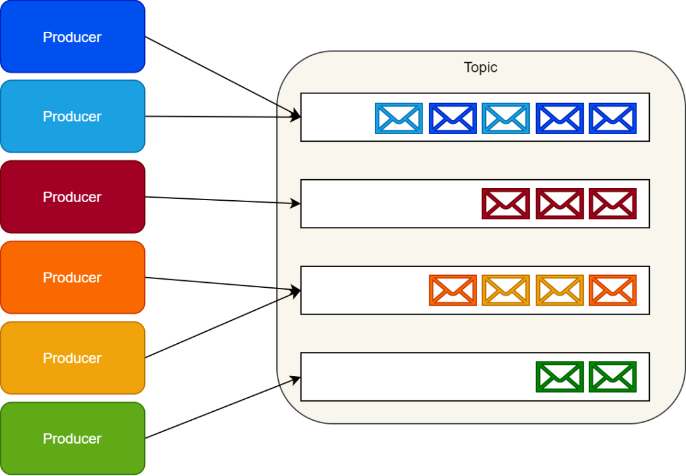

## kafka

   Kafka主要特点是基于Pull的模式来处理消息消费，追求高吞吐量。
   不支持事务，对消息的重复、丢失、错误没有严格要求，适合产生大量数据的互联网服务的数据收集业务。
   
   磁盘顺序存储，效率比内存还高。集群依赖zk，可快速水平扩展，支持分布式。
   
   两种模式
   
   点对点模式
   点对点模式是一个基于拉取或轮询的消息传送模型，由消费者主动拉取数据，客户端需要实时开启一个线程监控队列中是否有数据。
   
   发布/订阅模式
   发布/订阅模式是一个基于推送的消息传送模型，由MQ主动推送消息给所有订阅者，即使当前订阅者不可用
   
   
   
   
   
1. 概念
   
   producer: 生产者，负责消息生产   
   broker: 节点服务器，一个broker可容纳多个topic  
   topic: 主题，相当于一个队列  
   partition: 分区，可把一个topic分成多个区，每个partition内部有序  
   consumer: 消费者  
   consumer Group: 消费组，一个消费组消费同一个topic不会重复消费，一个partition只可能被同一个cg的一个消费者消费  
   leader: 负责给定Partition的所有读取和写入的节点  
   follower: 跟随Leader指令的节点被称为Follower。 如果Leader节点宕机，其中一个Follower将通过选举自动成为新的Leader  
   
   *写时分区*  
   Producer采用Push模式将消息发布到Broker，每条消息都被追加（append）到Partition中，
   属于顺序写磁盘（顺序写磁盘效率比随机写内存要高，保障Kafka吞吐率）。
   集群内存在多个副本。
   
   **分区的原则*  
   已指定Partition，则直接使用该Partition。
   未指定Partition但指定了Key，则通过对Key进行哈希计算得出一个Partition。
   Partition和Key都未指定，则轮询选出一个Partition。
   
   *存储策略*  
   无论消息是否被消费，Kafka都会保留所有消息。有两种策略可以删除旧数据:
   1. 基于时间：log.retention.hours=168
   2. 基于大小：log.retention.bytes=1073741824  

   需要注意的是，因为Kafka读取特定消息的时间复杂度为O(1)，即与文件大小无关，所以这里删除过期文件与提高Kafka性能无关。  
   zookeeper负责维护所有的broker consumer信息，consumer对应partition的offset
   
   *消费方式*  
   Consumer采用Pull模式从Broker中读取数据.  
   Push模式很难适应消费速率不同的Consumer，因为消息发送速率是由Broker决定的。它的目标是尽可能以最快速度传递消息，但是这样很容易造成Consumer来不及处理消息，典型的表现就是拒绝服务以及网络拥塞。而Pull模式则可以根据Consumer的消费能力以适当的速率消费消息。  
   对于Kafka而言，Pull模式更合适，它可简化Broker的设计，Consumer可自主控制消费消息的速率，
   同时Consumer可以自己控制消费方式——即可以批量消费也可以逐条消费，同时还能选择不同的提交方式从而实现不同的传输语义。Pull模式不足之处是，如果Kafka没有数据，消费者可能会陷入循环中，一直等待数据到达。  
   为了避免这种情况，可以Pull请求中设置参数，允许Consumer请求在等待数据到达的“长轮询”中进行阻塞（并且可选地等待到给定的字节数，以确保大的传输大小）。

2. 高可用部署

3. 适用场景

## rabbitMq kafka差异对比

   RabbitMQ是一个消息代理，Kafka是一个分布式流式系统。底层实现不一样，rabbit内存型消息系统默认情况下不对消息进行存储，消息消费完成即删除；
   kafka是追加日志的方式，顺序写磁盘（效率极高），可重复消费。
   
   **消息顺序性**  
   rabbit要保证消息顺序性只能通过设置一个队列一个消费者的模式。单队列多消费者的模式下，消息重试并不会阻塞后续消息的消费。
   kafka天然通过自身的数据分区实现消息顺序性，一个分区只可能被同一消费者里的一个消费者消费。要增加消费速度通过增加分区即可。
   
   **消息路由**  
   rabbit通过主题交换器，routing_key实现消息的过滤，以及路由到bind队列。
   kafka通过topic下设置不同的分区来实现，在消息生产时指定或者根据策略生成，无法实现对非法数据的过滤，只能应用层流式处理。
   
   **消息存活/延时消息**  
   rabbit天然支持设置消息ttl，对于过期的消息会被移到死信交换机上，此模式对那些有时效性的命令特别有用。
   rabbit可通过增加插件的方式实现延时消息。
   kafka的分区追加事务日志的模式无法支持对消息时间进行处理，只能应用层自身实现。
   
   **消息留存**  
   当消费者成功消费消息之后，RabbitMQ就会把对应的消息从存储中删除。
   Kafka会给每个主题配置超时时间，只要没有达到超时时间的消息都会保留下来。在消息留存方面，Kafka仅仅把它当做消息日志来看待，并不关心消费者的消费状态。
   Kafka的性能不依赖于存储大小。所以，理论上，它存储消息几乎不会影响性能。
   
   **性能/集群伸缩**  
   通常情况下，kafka会比rabbitmq具有更优越的性能。特别对于高并发读写，数据需要落地到磁盘的场景。
   都支持分布式集群，Kafka横向扩展性比rabbit好，支持数据多副本。rabbit在集群上的表现更为复杂些。
   
   **消费者复杂度**  
   对于简单消息队列模式rabbit更具优势，只需定义好交换器，routing_key 以及队列即可。rabbit会负责消息的维护删除等。
   kafka需要使用者自身设置分区，消费组等，自身维护offset。
   
## 消息组件选择

   异步处理 - 相比于传统的串行、并行方式，提高了系统吞吐量。  
   应用解耦 - 系统间通过消息通信，不用关心其他系统的处理。  
   流量削锋 - 可以通过消息队列长度控制请求量；可以缓解短时间内的高并发请求。  
   日志处理 - 解决大量日志传输。  
   消息通讯 - 消息队列一般都内置了高效的通信机制，因此也可以用在纯的消息通讯。比如实现点对点消息队列，或者聊天室等。  

   优先选择RabbitMQ的条件：  
   1. 高级灵活的路由规则；
   2. 消息时序控制（控制消息过期或者消息延迟）；
   3. 高级的容错处理能力，在消费者更有可能处理消息不成功的情景中（瞬时或者持久）；
   4. 更简单的消费者实现。
   
   优先选择Kafka的条件：
   1. 严格的消息顺序；
   2. 延长消息留存时间，包括过去消息重放的可能；
   3. 传统解决方案无法满足的高伸缩能力。