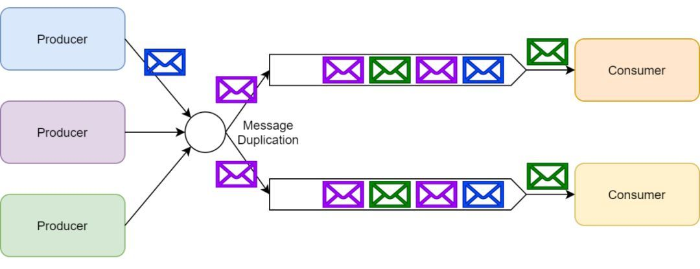

## rabbitMq

   基于AMQP协议来实现，AMQP的主要特征是面向消息、队列、路由（包括点对点和发布/订阅）、可靠性、安全。
   AMQP协议更多用在企业系统内，对数据一致性、稳定性和可靠性要求很高的场景，对性能和吞吐量的要求还在其次。
   
   内存型消息组件，可扩展性差，集群方案较难部署，不支持水平扩展，不支持分布式。
   
   工作原理
   
   消息发送到主服务器的exchange，交换机根据bind的routing key进行消息分发至queue，consumer从queue进行消费。
   
   
   **队列模式**
   
   开发者可以定义一个命名队列，然后发布者可以向这个命名队列中发送消息。最后消费者可以通过这个命名队列获取待处理的消息。
   
   **发布/订阅**
   
   使用消息交换器来实现发布/订阅模式。发布者可以把消息发布到消息交换器上而不用知道这些消息都有哪些订阅者。
   
   每一个订阅了交换器的消费者都会创建一个队列；然后消息交换器会把生产的消息放入队列以供消费者消费。消息交换器也可以基于各种路由规则为一些订阅者过滤消息。
   
1. 消息持久化
    
   默认情况下，exchange、queue、message 等数据都是存储在内存中的，这意味着如果 RabbitMQ 重启、关闭、宕机时所有的信息都将丢失。
   
   RabbitMQ 持久化包含3个部分
   
   exchange 持久化，在声明时指定 durable 为 true
   queue 持久化，在声明时指定 durable 为 true
   message 持久化，在投递时指定 delivery_mode=2（1是非持久化）
   
   queue 的持久化能保证本身的元数据不会因异常而丢失，但是不能保证内部的 message 不会丢失。要确保 message 不丢失，还需要将 message 也持久化
   如果 exchange 和 queue 都是持久化的，那么它们之间的 binding 也是持久化的。
   如果 exchange 和 queue 两者之间有一个持久化，一个非持久化，就不允许建立绑定。

2. 集群高可用部署
   
   **集群原理**
   
   1. 每个节点对等，并不存在leader/follower。每个节点保存所有交换器，队列等元数据信息，必须至少有一个磁盘节点，及若干RAM内存节点。
   2. 队列的消息数据只保存在其分配的节点上。
   3. 每个节点都可接受请求，对于队列数据不在本节点上的请求会做转发。
   4. 上层通过HAPROXY做软负载均衡，磁盘节点不参与负载，不提供外部访问。
   
3. 适用场景
   