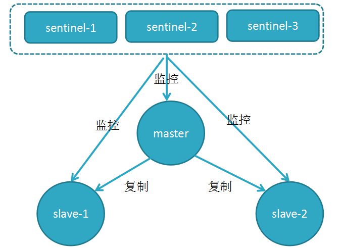

# Redis

内存高速缓存数据库，全称为：Remote Dictionary Server（远程数据服务）。
拥有非常高的性能，单个实例读的速度是110000次/s,写的速度是81000次/s。
支持的数据类型：string, list, set, zset, hash, hyperLogLogs, bitmaps, geospatial。

## 使用场景&个人实践

### 热点数据缓存
读写性能好，支持的数据类型多样，同时内部单线程写 支持事务保证数据一致性。

使用方式：
- 读取前，先去读Redis，如果没有数据，读取数据库，将数据拉入Redis；
- 写入DB的同时写入Redis；
- 异步线程读库写入；

常见缓存问题 

**缓存穿透**  
指大量用户同时访问不存在的key，导致请求直接穿透到数据库层。
    
解决方案：
1. 对内部的合法key实行一定的命名规范，非法key未满足正则表达式的直接返回
2. 结合具体场景，数据敏感度不高的业务，可只读缓存。另一个线程负责将数据库中的数据更新到缓存
3. 将数据库查询回来的值，不管是否查到，都写入缓存。
4. 布隆过滤器，将所有合法key预先使用布隆过滤器加载到内存
        
**热点数据**  
指大量请求同时访问同一个数据，而缓存恰好失效，此时qps直接打到数据库层

解决方案：
1. 请求数据库时先获取一个分布式锁，拿到锁的才能请求数据库，未拿到的自循环等待一定时间/次数
2. 请求入队列，排队请求数据
3. 对数据延时性要求不高的场景，可设置key不过期，异步线程负责更新数据

**缓存雪崩**  
同一时间大面积的key集体失效，所有请求直接打到数据库

解决方案：
1. 给缓存的失效时间，加上一个随机值，避免集体失效
2. 双缓存，A缓存有过期时间，B缓存长期有效，异步线程负责更新
    
**缓存、数据库一致性**  
只能保证最终一致性。先更新数据库，再删缓存。可能存在删除缓存失败的问题，提供一个补偿措施即可，例如利用消息队列。

解决方案：
1. 一致性要求高场景，实时同步方案，即查询redis，若查询不到再从DB查询，保存到redis；
2. 结合kafka mysql.binlog，异步线程消费消息更新缓存
3. mysql触发器的机制，对数据库压力大


### 缓存有一定时效性的数据
利用Redis的给key设置ttl，到期自动删除。如手机验证码，限时优惠活动等。

### 计数器
redis由于incrby命令可以实现原子性的递增，所以可以运用于高并发的秒杀活动、分布式序列号的生成、qps统计等。

### 分布式锁
主要利用redis的setnx命令进行，setnx："set if not exists"就是如果不存在则成功设置缓存同时返回1，否则返回0。

- 加锁命令：SETNX key value，当键不存在时，对键进行设置操作并返回成功，否则返回失败。KEY 是锁的唯一标识，一般按业务来决定命名。
- 解锁命令：DEL key，通过删除键值对释放锁，以便其他线程可以通过 SETNX 命令来获取锁。
- 锁超时：EXPIRE key timeout, 设置 key 的超时时间，以保证即使锁没有被显式释放，锁也可以在一定时间后自动释放，避免资源被永远锁住。

### 分布式限流器
利用redis执行Lua脚本是的事务保证，实现redis+lua的分布式限流器。
核心原理是将多个针对多个redis-key的操作放在一个Lua脚本里执行，由于 Lua 脚本是提交到 Redis server 进行一次性执行的，整个执行过程中不会被其他任何工作打断，其它任何脚本或者命令都无法执行,也就不会引起竞争条件，从而本身就实现了事务的原子性。

[实现参考](https://github.com/xiaomLee/go-plugin/tree/master/ratelimit/ratelimit-redis)

### 排行榜
利用Zset进行热点数据排序

### 延时队列
利用redis+zset实现延时队列。
1. score = timestamp, zset key value score
2. 服务range 数据 < time.now.unix 取出所有值进行处理
3. 处理失败的数据可再次回写

### 简单队列
利用redis list数据类型进行相关操作

### 点赞 好友关系的存储
利用set结果进行存储，同时利用redis提供的相关交并集的命令进行操作

### 基数统计
利用hyperloglogs，对大流量数据进行统计计算。如网站流量，商场客流。


## 核心原理架构

Redis核心原理由以下几部分组成：
- 基础数据类型以及其底层数据结构实现
- 持久化
- 网络模型，事务

### 数据类型&数据结构

**String**
String类型是二进制安全的，意思是 redis 的 string 可以包含任何数据。如数字，字符串，jpg图片或者序列化的对象。

命令：get set del incr decr incrby decrby 

**List**
双向链表。使用List结构，我们可以轻松地实现最新消息排队功能（比如新浪微博的TimeLine）。List的另一个应用就是消息队列，可以利用List的 PUSH 操作，将任务存放在List中，然后工作线程再用 POP 操作将任务取出进行执行。

命令： rpuhs lpush rpop lpop lrange lindex

**Set**
Set 是 String 类型的无序集合。通过哈希表实现的，所以添加，删除，查找的复杂度都是 O(1)。集合元素不能重复

命令：sadd scard smembers sismember

**Hash Map**
hash map 是一个 string 类型的 field（字段） 和 value（值） 的映射表，特别适合用于存储对象。

命令： hset hget hgetall hdel

**Zset**
有序集合和集合一样也是 string 类型元素的集合,且不允许重复的成员。可增加一个Score分数用于排序。

实现方式：
- 压缩列表(ziplist): 双向链表，数量少于128时使用
- 跳跃表（zSkiplist): 插入查找的复杂度保证在O(log(n), 数量大于128时使用

命令： zadd zrange zrem

**Hyperloglogs**
基数统计。基数指的是去除重复元素后的序列。基于基数估计算法实现而来，存在一定误差(0.81%误差值之内)。
这个结构可以非常省内存的去统计各种计数，比如注册 IP 数、每日访问 IP 数、页面实时UV、在线用户数，共同好友数等。

命令：pfadd pfcount pfmerge

**Bitmap**
位图数据结构，都是操作二进制位来进行记录，只有0 和 1 两个状态。
可用于存储简单状态数据，布隆过滤器等场景

命令：setbit getbit

**Geospatial**
这个功能可以推算地理位置的信息: 两地之间的距离, 方圆几里的人。
geo底层的实现原理实际上就是Zset, 我们可以通过Zset命令来操作geo，经纬度实际被转换成score。

命令：geoadd geopos geodist georadius georadiusbymember geohash


#### 对象机制、编码格式、数据库

**redisObject**

Redis每种数据类型都是由redisObject这个结构来实现的，redisObject最终的底层结构是由type + encoding来决定的。

redisObject的意义在于提供所有键，值底层数据存储的统一抽象，类似于go里面的interface，实现了类型的多态。
根据type的不一样，又可实现不同的操作函数， 比如针对string list的数据类型提供lpush的不同命令。
encoding类型决定了如何操作底层内存结构，根据底层数据的编码方式实现对应的增删改查接口。

redisObject数据结构
```c
// Redis 对象
typedef struct redisObject {
    // 类型 4bit
    //
    // #define OBJ_STRING 0 // 字符串
    // #define OBJ_LIST 1 // 列表
    // #define OBJ_SET 2 // 集合
    // #define OBJ_ZSET 3 // 有序集
    // #define OBJ_HASH 4 // 哈希表
    //
    unsigned type:4;

    // 编码方式 4bit
    //
    // #define OBJ_ENCODING_RAW 0     /* Raw representation */
    // #define OBJ_ENCODING_INT 1     /* Encoded as integer */
    // #define OBJ_ENCODING_HT 2      /* Encoded as hash table */
    // #define OBJ_ENCODING_ZIPMAP 3  /* 注意：版本2.6后不再使用. */
    // #define OBJ_ENCODING_LINKEDLIST 4 /* 注意：不再使用了，旧版本2.x中String的底层之一. */
    // #define OBJ_ENCODING_ZIPLIST 5 /* Encoded as ziplist */
    // #define OBJ_ENCODING_INTSET 6  /* Encoded as intset */
    // #define OBJ_ENCODING_SKIPLIST 7  /* Encoded as skiplist */
    // #define OBJ_ENCODING_EMBSTR 8  /* Embedded sds string encoding */
    // #define OBJ_ENCODING_QUICKLIST 9 /* Encoded as linked list of ziplists */
    // #define OBJ_ENCODING_STREAM 10 /* Encoded as a radix tree of listpacks */
    //
    unsigned encoding:4;

    // LRU - 24位, 记录最末一次访问时间（相对于lru_clock）; 或者 LFU（最少使用的数据：8位频率，16位访问时间）
    unsigned lru:LRU_BITS; // LRU_BITS: 24

    // 引用计数
    int refcount;

    // 指向底层数据内存地址，数据的读写方式由encoding决定
    void *ptr;

} robj;
```

**数据库**

Redis是一个键值对数据库，数据库中的键值对由字典保存：每个数据库都有一个对应的字典，这个字典被称之为键空间（key space）。
当用户添加一个键值对到数据库时（不论键值对是什么类型），程序就将该键值对添加到键空间；当用户从数据库中删除键值对时，程序就会将这个键值对从键空间中删除。flushdb dbsize info object等命令可以操作键空间。

redisDb提供所有对键相关的操作实现。

redisDb数据结构
```c
// redis.h/redisDb
typedef struct redisDb {

    // 保存着数据库以整数表示的号码
    int id;

    // 保存着数据库中的所有键值对数据
    // 这个属性也被称为键空间（key space）
    dict *dict;

    // 保存着键的过期信息
    dict *expires;

    // 实现列表阻塞原语，如 BLPOP
    // 在列表类型一章有详细的讨论
    dict *blocking_keys;
    dict *ready_keys;

    // 用于实现 WATCH 命令
    // 在事务章节有详细的讨论
    dict *watched_keys;

} redisDb;
```

当Redis服务器初始化时，它会创建出 redis.h/REDIS_DEFAULT_DBNUM 个数据库，并将所有数据库(redisDb实例)保存到redis.h/redisServer.db数组中，每个数据库的id为从0到REDIS_DEFAULT_DBNUM - 1的值。

dict属性中存储着当前键空间所有的key-value：key的实现是字符串对象(stringObject)，value是一个redisObject指针。

**类型检查&多态**

数据操作时的内部流程
1. 根据给定的key查询数据库的键空间，未找到返回Null，反之返回redisObject对象
2. 根据redistObject.type检查与将要执行的命令是否匹配，不匹配返回类型错误
3. 根据redisObject.encoding进行底层数据的具体操作，返回执行结果

**引用计数以及对象的消毁**

- 每个redisObject结构都带有一个refcount属性，指示这个对象被引用了多少次；
- 当新创建一个对象时，它的refcount属性被设置为1；
- 当对一个对象进行共享时，redis将这个对象的refcount加一；
- 当使用完一个对象后，或者消除对一个对象的引用之后，程序将对象的refcount减一；
- 当对象的refcount降至0 时，这个RedisObject结构，以及它引用的数据结构的内存都会被释放。

**小结**

- redis使用自己实现的对象机制（redisObject)来实现类型判断、命令多态和基于引用次数的垃圾回收。
- redis会预分配一些常用的数据对象，并通过共享这些对象来减少内存占用，和避免频繁的为小对象分配内存。


#### 底层数据结构

   
**SDS**
简单动态字符串（simple dynamic string,SDS）的抽象类型，作为Redis的默认字符串表示，键空间中的key都是由该编码来实现。

sds数据结构
```c
// src/sds.h
// src/sds.c
typedef struct sdshdr {
    // buf 中已占用空间的长度
    int len;

    // buf 除过头部与末尾的\0, 剩余的字节数
    // 头部字节数是动态的，主要是len alloc 的数据类型分别支持uint8, uint16, uint32, uint64
    // 根据flags而定
    int alloc;

    // 始终为一字节, 以低三位标示着头部的类型, 高5位未使用
    // 头部类型指的是len alloc的数据类型，分别是uint8, uint16, uint32, uint64
    // 根据flags不同，实际sds的实现也略有不同，分为：sdshar8, sdshar16, sdshar32, sdshar64
    unsigned char flags 

    // 数据空间
    char buf[];
};
```

相比于C寓言字符串的优势：
- 常数时间获取Len
- 杜绝缓冲区溢出：在插入拼接时，会预先检查len与alloc的值
- 空间预分配+惰性释放：buf空间扩展时，会预先请求扩展比实际需求更大的内存；buf收缩时，只是改变alloc的值记录空闲，留待下次使用
- 二进制安全：根据len进行二进制读取，防止空字符串对数据的影响(比如图片、音视频数据)
- 兼容部分C字符串函数


**ZipList**
压缩链是为了提高存储效率而设计的一种特殊编码的双向链表。它可以存储字符串或者整数。指向一块连续的内存，遍历的时候从尾部开始向前遍历，通过pre_content_length计算前一个数据块的大小

| zlbytes | zltail | zlen | entry1 | entry2 | ... | entryN | zlend |

zlbytes：记录整个压缩列表占用的内存字节数，在压缩列表内存重分配，或者计算zlend的位置时使用

zltail：记录压缩列表表尾节点距离压缩列表的起始地址有多少字节，通过该偏移量，可以不用遍历整个压缩列表就可以确定表尾节点的地址

zllen：记录压缩列表包含的节点数量，但该属性占两字节，值小于UINT16_MAX（65535）时，该值就是压缩列表的节点数量；当zllen=65535时，需要遍历整个压缩列表才能计算出真实的节点数量

entryX：压缩列表的节点

zlend：特殊值0xFF（十进制255），用于标记压缩列表的末端

entry结构
```c
typedef struct zlentry {
    unsigned int prevrawlensize; /* Bytes used to encode the previous entry len*/
    unsigned int prevrawlen;     /* Previous entry len. */
    unsigned int lensize;        /* Bytes used to encode this entry type/len.
                                    For example strings have a 1, 2 or 5 bytes
                                    header. Integers always use a single byte.*/
    unsigned int len;            /* Bytes used to represent the actual entry.
                                    For strings this is just the string length
                                    while for integers it is 1, 2, 3, 4, 8 or
                                    0 (for 4 bit immediate) depending on the
                                    number range. */
    unsigned int headersize;     /* prevrawlensize + lensize. */
    unsigned char encoding;      /* Set to ZIP_STR_* or ZIP_INT_* depending on
                                    the entry encoding. However for 4 bits
                                    immediate integers this can assume a range
                                    of values and must be range-checked. */
    unsigned char *p;            /* Pointer to the very start of the entry, that
                                    is, this points to prev-entry-len field. */
} zlentry;
```

存在两种结构：
1. 一般结构：<prevlen> <encoding> <entry-data>
2. entry中存储的是数字时：encoding和entry-data会合并在encoding中表示，此时没有entry-data字段 <prevlen> <encoding>

- prevlen：记录压缩列表前一个entry的大小。当前一个元素长度小于254（255用于zlend）的时候，prevlen长度为1个字节(8bit)，值即为前一个entry的长度，如果长度大于等于254的时候，prevlen用5个字节表示，第一字节设置为254，后面4个字节存储一个小端的无符号整型，表示前一个entry的长度
- encoding：节点的encoding保存的是节点的entry的内容类型。前两位用来表示类型，当为“11”时，表示entry存储的是int类型，其它表示存储的是string
- entry：entry区域用于保存节点的内容，节点内容类型和长度由encoding决定

优缺点：
- 连续内存，节省空间。直接根据encoding来决定下一个与前一个node节点的存取，减少存储pre,next指针的空间
- 不预留空间，每次插入删除都需要重新扩缩容进行内存重分配，高并发写的场景下效率低

**QuickList**

双向链表。每个node节点持有一个ziplist指针用来存储节点值，这表明每个node节点实际可存储多个value，且value被存放在一个压缩链表中。

数据结构
```c
/* quicklist is a 40 byte struct (on 64-bit systems) describing a quicklist.
 * 'count' is the number of total entries.
 * 'len' is the number of quicklist nodes.
 * 'compress' is: -1 if compression disabled, otherwise it's the number
 *                of quicklistNodes to leave uncompressed at ends of quicklist.
 * 'fill' is the user-requested (or default) fill factor.
 * 'bookmakrs are an optional feature that is used by realloc this struct,
 *      so that they don't consume memory when not used. */
typedef struct quicklist {
    quicklistNode *head;
    quicklistNode *tail;
    unsigned long count;        /* total count of all entries in all ziplists */
    unsigned long len;          /* number of quicklistNodes */
    int fill : QL_FILL_BITS;              /* fill factor for individual nodes */
    unsigned int compress : QL_COMP_BITS; /* depth of end nodes not to compress;0=off */
    unsigned int bookmark_count: QL_BM_BITS;
    quicklistBookmark bookmarks[];
} quicklist;

/* quicklistNode is a 32 byte struct describing a ziplist for a quicklist.
 * We use bit fields keep the quicklistNode at 32 bytes.
 * count: 16 bits, max 65536 (max zl bytes is 65k, so max count actually < 32k).
 * encoding: 2 bits, RAW=1, LZF=2.
 * container: 2 bits, NONE=1, ZIPLIST=2.
 * recompress: 1 bit, bool, true if node is temporarry decompressed for usage.
 * attempted_compress: 1 bit, boolean, used for verifying during testing.
 * extra: 10 bits, free for future use; pads out the remainder of 32 bits */
typedef struct quicklistNode {
    struct quicklistNode *prev;
    struct quicklistNode *next;
    unsigned char *zl;
    unsigned int sz;             /* ziplist size in bytes */
    unsigned int count : 16;     /* count of items in ziplist */
    unsigned int encoding : 2;   /* RAW==1 or LZF==2 */
    unsigned int container : 2;  /* NONE==1 or ZIPLIST==2 */
    unsigned int recompress : 1; /* was this node previous compressed? */
    unsigned int attempted_compress : 1; /* node can't compress; too small */
    unsigned int extra : 10; /* more bits to steal for future usage */
} quicklistNode;

/* quicklistLZF is a 4+N byte struct holding 'sz' followed by 'compressed'.
 * 'sz' is byte length of 'compressed' field.
 * 'compressed' is LZF data with total (compressed) length 'sz'
 * NOTE: uncompressed length is stored in quicklistNode->sz.
 * When quicklistNode->zl is compressed, node->zl points to a quicklistLZF */
typedef struct quicklistLZF {
    unsigned int sz; /* LZF size in bytes*/
    char compressed[];
} quicklistLZF;
```

优缺点：
- 通过每个节点持有一个压缩链表，存储多个value，减少了链表总长度，以及大量节点指针带来的内存占用
- 但每次写操作都需操作节点持有的ziplist，重新分配内存，带来一定性能损耗

**Dict**
哈希表
  ```c
// hash表数组
typedef struct dictht {
    // 哈希表数组
    dictEntry **table;
    // 哈希表大小
    unsigned long size;
    // 哈希表大小掩码，用于计算索引值，等于size-1
    unsigned long sizemask;
    // 哈希表已有节点的数量
    unsigned long used;
} dictht;

// hash值链表
typedef struct dictEntry {
    // 键
    void *key;
    // 值
    union {
        void *val;
        uint64_t u64;
        int64_t s64;
        double d;
    } v;
    // 指向下一个哈希表节点，形成链表
    struct dictEntry *next;
} dictEntry;

// hash结构体
typedef struct dict {
    // 和类型相关的处理函数，用于hash计算
    dictType *type;
    // 私有数据
    void *privdata;
    // 哈希表, 一般只是用ht[0]， ht[1]在数据量较大 需要rehash时使用
    dictht ht[2];
    // rehash 索引，当rehash不再进行时，值为-1
    long rehashidx; /* rehashing not in progress if rehashidx == -1 */
    // 迭代器数量
    unsigned long iterators; /* number of iterators currently running */
} dict;
```

dict(字典) --> dictht(hash表) --> dictEntry(数据)

解决哈希冲突：方法是链地址法，通过字典里面的 *next 指针指向下一个具有相同索引值的哈希表节点。

扩缩容步骤：
1. 根据dict.ht[0].used来计算扩缩容的大小。扩容是*2，整体扩大一倍，缩容/2 整体缩小一倍
2. 对dict.ht[0]中的所有键值重新计算，放到新的ht
3. 所有数据迁移完成，释放原有内存空间

触发扩容的条件： 
1. 服务器目前没有执行 BGSAVE 命令或者 BGREWRITEAOF 命令，并且负载因子大于等于1。
2. 服务器目前正在执行 BGSAVE 命令或者 BGREWRITEAOF 命令，并且负载因子大于等于5。 

ps：负载因子 = 哈希表已保存节点数量 / 哈希表大小。

渐近式rehash: 扩容和收缩操作不是一次性、集中式完成的，而是分多次、渐进式完成的。如果保存在Redis中的键值对只有几个几十个，那么 rehash 操作可以瞬间完成，但是如果键值对有几百万，几千万甚至几亿，那么要一次性的进行 rehash，势必会造成Redis一段时间内不能进行别的操作。所以Redis采用渐进式 rehash,这样在进行渐进式rehash期间，字典的删除查找更新等操作可能会在两个哈希表上进行，第一个哈希表没有找到，就会去第二个哈希表上进行查找。但是进行 增加操作，一定是在新的哈希表上进行的。总结来说就是有条件的双写双读。

**IntSet**
整数集。当一个集合只包含整数值元素，并且这个集合的元素数量不多时，Redis 就会使用整数集合作为集合键的底层实现。

数据结构
```c
typedef struct intset {
    // 编码方式，的取值有三个：INTSET_ENC_INT16, INTSET_ENC_INT32, INTSET_ENC_INT64
    uint32_t encoding;

    // 代表其中存储的整数的个数
    uint32_t length;

    // 指向实际存储数值的连续内存区域
    int8_t contents[];
} intset;
```

contents数组的读取依赖encoding的值，当新写入的整数与原有encoding不符时(比如原有encoding=int16，插入的是int32)，需要对inset进行升级。不会主动进行降级。

升级步骤：
1. 根据新元素的类型确定encoding，以及重新计算数组大小，申请内存
2. 将现有元素转换成新类型，并写入到新数组
3. length++


**SkipList**
跳跃表。多层链表结构，插入时数据的层高随机决定。目前Redis中仅作为ZSet数据类型的底层存储使用。

数据结构：
```c
/* ZSETs use a specialized version of Skiplists */
typedef struct zskiplistNode {
    sds ele;
    double score;
    struct zskiplistNode *backward;
    struct zskiplistLevel {
        struct zskiplistNode *forward;
        unsigned int span;
    } level[];
} zskiplistNode;

typedef struct zskiplist {
    struct zskiplistNode *header, *tail;
    unsigned long length;
    int level;
} zskiplist;
```

跳表核心原理：
- skiplist维护一个头指针、当前节点数量、以及最大层高
- node节点维护当前的节点值，以及一个forwards数组，数组大小为max_level
- 当要插入数据时，通过算法随机一个层高，然后将该数据插入到所有小于该层层高的链表中

Redis基于通用的跳表做了扩展，维护了一个tail指针，同时在node节点上增加了一个backward指针，用于回退到上一层。这个指针被用来实现zrange相关的功能。


#### 数据类型与编码的对应关系

**string**  
有三种编码实现：REDIS_ENCODING_INT REDIS_ENCODING_EMBSTR REDIS_ENCODING_RAW  

EMBSTR RAW 内存实现都是简单动态字符串

EMBSTR用来保存短字符串的编码方式。当字符串保存的是一个小于等于44个字节的字符串时，那么robj对象里的属性ptr就会指向一个SDS对象。
embstr编码通过调用一次内存分配函数来创建一块连续的内存空间，即redisObject对象和它的ptr指针指向的SDS对象是连续的。
不过embstr编码的字符串对象是只读性的，一旦对其指向APPEND命令追加字符串会导致其变为raw编码实现。

**list**  
两种编码实现：REDIS_ENCODING_ZIPLIST REDIS_ENCODING_QUICKLIST
数据元素数量不超过128时，使用压缩链表，反之使用快表

**hash**  
编码实现：REDIS_ENCODING_ZIPLIST REDIS_ENCODING_HT
数据元素数量不超过512，且每个元素长度小于64字节 使用压缩链表；反之使用hash表

**set**  
编码实现：REDIS_ENCODING_INTSET REDIS_ENCODING_HT
存储的元素时整数 且元素数量小于512，使用整数集合实现；反之哈希表实现

**zset/ sorted set**  
编码实现：REDIS_ENCODING_ZIPLIST REDIS_ENCODING_SKIPLIST
数据元素数量不超过128 且所有元素长度都小于64字节时，使用压缩链表；反之使用跳跃链表


### 持久化

redis提供了两种持久化的方式，分别是**RDB（Redis DataBase）**和**AOF（Append Only File）**。  

RDB：简而言之，就是在不同的时间点，将redis存储的数据生成快照并存储到磁盘等介质上；快照的性质必然导致磁盘的数据时落后于内存的，但是数据恢复快。

AOF：换了一个角度来实现持久化，那就是将redis执行过的所有写指令记录下来，在redis重新启动时，所有写指令按序重放，以实现数据恢复。

**RDB**

触发rdb持久化的方式有2种，分别是手动触发和自动触发。

手动触发有save、bgsave两个命令。区别如下。
- save：阻塞当前Redis服务器，直到RDB过程完成为止，对于内存比较大的实例会造成长时间阻塞，线上环境不建议使用
- bgsave：Redis进程执行fork操作创建子进程，RDB持久化过程由子 进程负责，完成后自动结束。阻塞只发生在fork阶段，一般时间很短

bgsave执行步骤：
1. redis客户端执行bgsave命令或者自动触发bgsave命令；
2. 主进程判断当前是否已经存在正在执行的子进程，如果存在，那么主进程直接返回；
3. 如果不存在正在执行的子进程，那么就fork一个新的子进程进行持久化数据，fork过程是阻塞的，fork操作完成后主进程即可执行其他操作；
4. 子进程先将数据写入到临时的rdb文件中，待快照数据写入完成后再原子替换旧的rdb文件；
5. 同时发送信号给主进程，通知主进程rdb持久化完成，主进程更新相关的统计信息（info Persitence下的rdb_*相关选项）。


自动触发条件
1. redis.conf中配置save m n，即在m秒内有n次修改时，自动触发bgsave生成rdb文件；  
2. 主从复制时，从节点要从主节点进行全量复制时也会触发bgsave操作，生成当时的快照发送到从节点；
3. 执行debug reload命令重新加载redis时也会触发bgsave操作；
4. 默认情况下执行shutdown命令时，如果没有开启aof持久化，那么也会触发bgsave操作；

rdb相关配置
```shell
# 周期性执行条件的设置格式为
save <seconds> <changes>
# 默认的设置为：
save 900 1
save 300 10
save 60 10000

# 以下设置方式为关闭RDB快照功能
save ""

# 文件名称
dbfilename dump.rdb
# 文件保存路径
dir /home/work/app/redis/data/
# 如果持久化出错，主进程是否停止写入
stop-writes-on-bgsave-error yes
# 是否压缩
rdbcompression yes
# 导入时是否检查
rdbchecksum yes
```

RDB常见问题

1. bgsave过程中出现写操作，如何保证数据一致性？

    RDB中的核心思路是Copy-on-Write，来保证在进行快照操作的这段时间，需要压缩写入磁盘上的数据在内存中不会发生变化。在正常的快照操作中，一方面Redis主进程会fork一个新的快照进程专门来做这个事情，这样保证了Redis服务不会停止对客户端包括写请求在内的任何响应。另一方面这段时间发生的数据变化会以副本的方式存放在另一个新的内存区域，待快照操作结束后才会同步到原来的内存区域。
    简单来说就是主进程检测到当前在执行bgsave操作，这时执行写操作，会将对应的数据copy一份，bgsave落地的是数据的拷贝。

2. 快照期间服务崩溃如何处理

    在没有将数据全部写入到磁盘前，这次快照都不算成功，恢复时用的还是原来的备份。bgsave进程首先创建的是一个临时文件，全部完成后才会执行替换。

3. 可以每秒做一次快照嘛

    虽然bgsave执行时不阻塞主线程，但是，如果频繁地执行全量快照，也会带来两方面的开销：fork时会阻塞主进程，同时fork进程也会带来很大开销；每次都是全量替换(即使没有变更),写入磁盘的压力；

RDB优缺点
- RDB文件是某个时间节点的快照，默认使用LZF算法进行压缩，压缩后的文件体积远远小于内存大小，适用于备份、全量复制等场景；
- Redis加载RDB文件恢复数据要远远快于AOF方式；
- RDB方式实时性不够，无法做到秒级的持久化；
- 每次调用bgsave都需要fork子进程，fork子进程属于重量级操作，频繁执行成本较高；
- RDB文件是二进制的，没有可读性，AOF文件在了解其结构的情况下可以手动修改或者补全；
- 版本兼容RDB文件问题；

**AOF**

Redis是“写后”日志，Redis先执行命令，把数据写入内存，然后才记录日志(xxx.WAL)。日志里记录的是Redis收到的每一条命令，这些命令是以文本形式保存。

采用写后日志的优缺点：
- 避免语法检查，因为先写内存再写log，可以保证回放时都能执行成功
- 不会阻塞当前写操作
- 如果命令执行完成，写日志之前宕机了，可能会导致数据恢复时丢失数据
- 主线程写磁盘压力大，导致写盘慢，阻塞后续操作

AOF步骤：
1. append：服务器在执行完一个写命令之后，会以协议格式将被执行的写命令追加到服务器的aof_buf缓冲区
2. write & sync：always(同步写，数据可靠性高)、everysec(每秒，默认策略)、no(依赖操作系统的刷盘)

为了提高文件写入效率，在现代操作系统中，当用户调用write函数，将一些数据写入文件时，操作系统通常会将数据暂存到一个内存缓冲区里，当缓冲区的空间被填满或超过了指定时限后，才真正将缓冲区的数据写入到磁盘里。

这样的操作虽然提高了效率，但也为数据写入带来了安全问题：如果计算机停机，内存缓冲区中的数据会丢失。为此，系统提供了fsync、fdatasync同步函数，可以强制操作系统立刻将缓冲区中的数据写入到硬盘里，从而确保写入数据的安全性。

AOF相关配置
```sh
# appendonly参数开启AOF持久化
appendonly no

# AOF持久化的文件名，默认是appendonly.aof
appendfilename "appendonly.aof"

# AOF文件的保存位置和RDB文件的位置相同，都是通过dir参数设置的
dir ./

# 同步策略
# appendfsync always
appendfsync everysec
# appendfsync no

# aof重写期间是否同步
no-appendfsync-on-rewrite no

# 重写触发配置
auto-aof-rewrite-percentage 100
auto-aof-rewrite-min-size 64mb

# 加载aof出错如何处理
aof-load-truncated yes

# 文件重写策略
aof-rewrite-incremental-fsync yes
```
 
AOF文件重写：AOF文件持续增长而过大时，会fork出一条新进程(bgrewriteaof)来将文件重写(也是先写临时文件最后再rename)，遍历新进程的内存中数据，每条记录有一条的set语句。重写aof文件的操作，并没有读取旧的aof文件，而是将整个内存中的数据库内容用命令的方式重写了一个新的aof文件，这点和快照有点类似。重写时若有新数据写入，采用的是双写的方式，即新旧文件一块写。

AOF重写的触发：
- auto-aof-rewrite-min-size: 表示运行AOF重写时文件的最小大小，默认为64MB，默认配置；
- auto-aof-rewrite-percentage: 这个值的计算方式是，当前aof文件大小和上一次重写后aof文件大小的差值，再除以上一次重写后aof文件大小。也就是当前aof文件比上一次重写后aof文件的增量大小，和上一次重写后aof文件大小的比值；

redis提供了redis-check-aof工具，可以用来进行日志修复。

**数据恢复**

若redis开启了持久化，服务在重启时会自动从磁盘文件加载数据进行恢复。

数据恢复流程：
1. redis重启时判断是否开启aof，如果开启了aof，那么就优先加载aof文件；
2. 如果aof存在，那么就去加载aof文件，加载成功的话redis重启成功，如果aof文件加载失败，那么会打印日志表示启动失败，此时可以去修复aof文件后重新启动； 
3. 若aof文件不存在，那么redis就会转而去加载rdb文件，如果rdb文件不存在，redis直接启动成功；
4. 如果rdb文件存在就会去加载rdb文件恢复数据，如加载失败则打印日志提示启动失败，如加载成功，那么redis重启成功，且使用rdb文件恢复数据；

优先使用AOF是因为AOF保存的数据更完整，通过上面的分析我们知道AOF基本上最多损失1s的数据。

实践经验：
- 如果Redis中的数据并不是特别敏感或者可以通过其它方式重写生成数据，可以关闭持久化，如果丢失数据可以通过其它途径补回；
- 自己制定策略定期检查Redis的情况，然后可以手动触发备份、重写数据；
- 单机如果部署多个实例，要防止多个机器同时运行持久化、重写操作，防止出现内存、CPU、IO资源竞争，让持久化变为串行；
- 可以加入主从机器，利用一台从机器进行备份处理，其它机器正常响应客户端的命令；
- RDB持久化与AOF持久化可以同时存在，配合使用。


### 发布订阅

### 事务

### 事件模型

Redis中的事件驱动库只关注网络IO，以及定时器。

该事件库处理下面两类事件 
- 文件事件(file  event)：用于处理 Redis 服务器和客户端之间的网络IO。 
- 时间事件(time  eveat)：Redis 服务器中的一些操作（比如serverCron函数）需要在给定的时间点执行，而时间事件就是处理这类定时操作的。

aeEventLoop(事件管理器)是整个实践驱动的核心，它管理者文件事件表和时间事件表，不断循环处理就绪的事件。

#### 文件事件

文件事件处理器，也成网络事件处理器，使用IO多路复用技术，同时监听多个套接字，并为套接字关联不同的事件处理函数。当套接字的可读或者可写事件触发时，就会调用相应的事件处理函数。

**Redis IO多路复用模型**

类似于go里面net库的实现：
1. 每个连接到监听端口的请求，会被select/epoll模型accept，然后产生一个accept事件，加入到文件事件就绪队列，被redis主线程处理
2. accept事件被处理，产生一个客户端与服务端的连接套接字socket-fd
3. 新产生的socket-fd被加入到监听队列，被epool模型轮训监听read write事件
4. 每当有新事件产生都被加入到就绪事件队列，主线程处理并回调事件相对应的回调函数

#### 时间事件

分为定时时间和周期性事件。


## 高可用

### 内存淘汰机制
   
Redis在使用内存达到某个阈值（通过maxmemory配置)的时候，就会触发内存淘汰机制，选取一些key来删除。

内存淘汰有许多策略：
- noeviction：当内存不足以容纳新写入数据时，新写入操作会报错。默认策略
- allkeys-lru：当内存不足以容纳新写入数据时，在键空间中，移除最近最久未使用的key。
- allkeys-random：当内存不足以容纳新写入数据时，在键空间中，随机移除某个key。
- volatile-lru：当内存不足以容纳新写入数据时，在设置了过期时间的键空间中，移除最近最少使用的key。
- volatile-random：当内存不足以容纳新写入数据时，在设置了过期时间的键空间中，随机移除某个key。
- volatile-ttl：当内存不足以容纳新写入数据时，在设置了过期时间的键空间中，有更早过期时间的key优先移除。
   
内存相关配置项
```shell
# 配置内存阈值
maxmemory <bytes> 

# 内存淘汰策略
maxmemory-policy noeviction 
```

**LRU算法**

最近最少使用，Least Recently Used.

```sh
# 算法实现
# 需实现Get Set两个操作

# map+双向链表实现，count, cap记录当前的数量及容量， head tail分别记录头尾

Get：map.get --> remove --> addToHead
Set：map.get --> update --> remove --> addToHead
            |
            |
            --> addToHead --> count++ --> count > cap --> poptail --> count--
```

持久化写入和重载时，都会判断key是否过期，过期不载入。


### 主从复制

主从复制，是指将一台Redis服务器的数据，复制到其他的Redis服务器。前者称为主节点(master)，后者称为从节点(slave)；数据的复制是单向的，只能由主节点到从节点。

- 主从复制实现了数据的热备份，当主节点出现问题，可以由从节点提供服务，实现服务的快速恢复。
- 读写分离的方式增大了服务所能承载的并发量，尤其是在写少读多的场景下。
- 主从复制是哨兵和集群能够实现的基础，是Redis实现高可用的基础。

主从复制有全量复制和增量复制两种。首次同步时使用全量复制，之后执行增量复制。

**全量复制**

通过replicaof（Redis 5.0 之前使用 slaveof）命令形成主库和从库的关系，之后会按照三个阶段完成数据的第一次同步。

全量复制三阶段：

1. 建立连接

    从库给主库发送 psync 命令，表示要进行数据同步，主库根据这个命令的参数来启动复制。psync 命令包含了主库的 runID 和复制进度 offset 两个参数。runID，是每个 Redis 实例启动时都会自动生成的一个随机 ID，用来唯一标记这个实例。当从库和主库第一次复制时，因为不知道主库的 runID，所以将 runID 设为"?" offset，此时设为 -1，表示第一次复制。主库收到 psync 命令后，会用 FULLRESYNC 响应命令带上两个参数：主库 runID 和主库目前的复制进度 offset，返回给从库。从库收到响应后，会记录下这两个参数。这里有个地方需要注意，FULLRESYNC 响应表示第一次复制采用的全量复制，也就是说，主库会把当前所有的数据都复制给从库。

2. 全量数据复制

    第一阶段完成后，即fullsync命令之后，主库执行bgsave，生成RDB快照文件，完成后将RDB文件发送给从库。从库接收到RBD文件之后，首先清空自身本地数据库(flushall命令)，然后加载新的RBD文件。

3. 补充同步

    在全量RDB数据同步过程中，主库不会停服，期间发生的写操作会被记录在replication buffer中。当RDB发送完成后，会将replication-buffer中的数据发送给从库，从库重新执行。至此全量数据同步完成

**增量复制**

如果主从库在命令传播时出现了网络闪断，那么，从库就会和主库重新进行一次全量复制，开销非常大。Redis 2.8之后，网络断，主从库会采用增量复制的方式继续同步。

增量同步的机制主要依赖两个核心设计：写命令环形缓冲区(repl_backlog_buffer)，发送缓冲区(replication_buffer)

repl_backlog_buffer：设计的目的是为了在网络闪断之后更快的找到需要增量同步的写操作；环形队列，可缓存一定数据量的写操作

replication_buffer：发送缓冲区，将需要增量同步的写操作，存入缓冲区，再由Socket发送给从库

增量复制流程：
1. 从库发送psync [offset] 命令到主库，主库比较offset与环形缓冲区的值，判断是否全量；每个从库都会维护自身的slave_repl_offset
2. 若offset并没有落后于环形队列，则将环形队列里需要发送的写操作写入到replication_buffer，之后执行发送
3. 从库将收到的写操作重新执行


**常见问题**

1. 为何全量复制采用RDB而不是AOF
    
    RDB是经过压缩后的二进制数据，且是最终数据，不包含过程的冗余。文件小，加载快。
    此外若依赖AOF，那主库必然需要打开AOF功能，对Redis性能影响较大。

2. 什么是无磁盘模式

    master创建一个新进程直接dump RDB到slave的socket，不经过主进程，不经过硬盘。适用于disk较慢，并且网络较快的时候。
    使用repl-diskless-sync配置参数来启动无磁盘复制。
    使用repl-diskless-sync-delay 参数来配置传输开始的延迟时间；
    master等待一个repl-diskless-sync-delay的秒数，如果没slave来的话，就直接传，后来的得排队等了; 否则就可以一起传。

3. 最佳的主从集群配置

    一般推荐采用”主 - 从 — 从“ 的方式来搭建集群。这样可以比把所有的从直接挂在主上面性能更佳。
    当主连接了太多的从，会导致主服务器忙于fork子进程进行RDB同步。

4. 延迟、一致性问题

    延迟与数据的不一致不可避免。如果应用对数据不一致的接受程度程度较低，可能的优化措施包括：优化主从节点之间的网络环境（如在同机房部署）；监控主从节点延迟（通过offset）判断，如果从节点延迟过大，通知应用不再通过该从节点读取数据；使用集群同时扩展写负载和读负载等。

5. 数据过期问题

    单机版Redis数据过期策略
    - *定期删除*：Redis默认每隔100ms就随机抽取一些设置了过期时间的key，检测这些key是否过期，如果过期了就将其删掉。  
    - *惰性删除*：客户端要获取某个key的时候，Redis会先去检测一下这个key是否已经过期，如果没有过期则返回给客户端，如果已经过期了，执行删除。

    Redis是使用定期删除+惰性删除两者配合的过期策略。

    在主从复制场景下，为了主从节点的数据一致性，从节点不会主动删除数据，而是由主节点控制从节点中过期数据的删除。由于主节点的惰性删除和定期删除策略，都不能保证主节点及时对过期数据执行删除操作，因此，当客户端通过Redis从节点读取数据时，很容易读取到已经过期的数据。

**小结**

优点：
1. master能自动将数据同步到slave，可以进行读写分离，分担master的读压力
2. master、slave之间的同步是以非阻塞的方式进行的，同步期间，客户端仍然可以提交查询或更新请求

缺点：
1. 不具备自动容错与恢复功能，master或slave的宕机都可能导致客户端请求失败，需要等待机器重启或手动切换客户端IP才能恢复
2. master宕机，如果宕机前数据没有同步完，则切换IP后会存在数据不一致的问题
3. 难以支持在线扩容，Redis的容量受限于单机配置

### 哨兵机制(Redis Sentinel)

在Redis主从集群中，哨兵机制是实现主从库自动切换的关键机制，它有效地解决了主从复制模式下故障转移的问题。

哨兵实现的功能：
- 监控（Monitoring）：哨兵会不断地检查主节点和从节点是否运作正常。 
- 自动故障转移（Automatic failover）：当主节点不能正常工作时，哨兵会开始自动故障转移操作，它会将失效主节点的其中一个从节点升级为新的主节点，并让其他从节点改为复制新的主节点。 
- 配置提供者（Configuration provider）：客户端在初始化时，通过连接哨兵来获得当前Redis服务的主节点地址。 
- 通知（Notification）：哨兵可以将故障转移的结果发送给客户端。



**哨兵集群的通信原理**

在主从集群中，主库上有一个名为__sentinel__:hello的频道，不同哨兵就是通过它来相互发现，实现互相通信的。

比如哨兵 1 把自己的 IP（172.16.19.3）和端口（26579）发布到__sentinel__:hello频道上，哨兵 2 和 3 订阅了该频道。那么此时，哨兵 2 和 3 就可以从这个频道直接获取哨兵 1 的 IP 地址和端口号。然后，哨兵 2、3 可以和哨兵 1 建立网络连接。

**哨兵监控的原理**

1. 定时任务：每个哨兵节点维护了3个定时任务。定时任务的功能分别如下：通过向主从节点发送info命令获取最新的主从结构；通过发布订阅功能获取其他哨兵节点的信息；通过向其他节点发送ping命令进行心跳检测，判断是否下线。

2. 主观下线：在心跳检测的定时任务中，如果其他节点超过一定时间没有回复，哨兵节点就会将其进行主观下线。顾名思义，主观下线的意思是一个哨兵节点“主观地”判断下线；与主观下线相对应的是客观下线。

3. 客观下线：哨兵节点在对主节点进行主观下线后，会通过sentinel is-master-down-by-addr命令询问其他哨兵节点该主节点的状态；如果判断主节点下线的哨兵数量达到一定数值(配置文件中的quorum)，则对该主节点进行客观下线。

    需要特别注意的是，客观下线是主节点才有的概念；如果从节点和哨兵节点发生故障，被哨兵主观下线后，不会再有后续的客观下线和故障转移操作。
    假设哨兵集群有5个节点，quorum=2，当哨兵集群发生网络故障只剩2节点时。
    可以完成对主节点的客观下线，但是因为无法选举(选举需要半数以上投票)，故不能对主进行故障切换。即，下面的4，5步骤没法执行成功。

4. 选举领导者哨兵节点：当主节点被判断客观下线以后，各个哨兵节点会进行协商，选举出一个领导者哨兵节点，并由该领导者节点对其进行故障转移操作。

    监视该主节点的所有哨兵都有可能被选为领导者，选举使用的算法是Raft算法；Raft算法的基本思路是先到先得：即在一轮选举中，哨兵A向B发送成为领导者的申请，如果B没有同意过其他哨兵，则会同意A成为领导者。选举的具体过程这里不做详细描述，一般来说，哨兵选择的过程很快，谁先完成客观下线，一般就能成为领导者。

5. 故障转移：选举出的领导者哨兵，开始进行故障转移操作，该操作大体可以分为3个步骤：

    - 在从节点中选择新的主节点：选择的原则是，首先过滤掉不健康的从节点；然后选择优先级最高的从节点(由slave-priority指定)；如果优先级无法区分，则选择复制偏移量最大的从节点；如果仍无法区分，则选择runid最小的从节点。
    - 更新主从状态：通过slaveof no one命令，让选出来的从节点成为主节点；并通过slaveof命令让其他节点成为其从节点。
    - 将已经下线的主节点设置为新的主节点的从节点，当oldmaster重新上线后，它会成为新的主节点的从节点。


**集群搭建实践**

1. 部署主从节点
```sh
#redis-6379.conf
port 6379
daemonize yes
logfile "6379.log"
dbfilename "dump-6379.rdb"
 
#redis-6380.conf
port 6380
daemonize yes
logfile "6380.log"
dbfilename "dump-6380.rdb"
slaveof 192.168.92.128 6379
 
#redis-6381.conf
port 6381
daemonize yes
logfile "6381.log"
dbfilename "dump-6381.rdb"
slaveof 192.168.92.128 6379


#配置完成后，依次启动主节点和从节点
redis-server redis-6379.conf
redis-server redis-6380.conf
redis-server redis-6381.conf

#启动完成后 连接主节点查看主从状态
redis-cli -h 192.168.92.128 6379
>info Replication
```

2. 部署哨兵节点
```sh
#哨兵节点本质上是特殊的Redis节点
#sentinel-26379.conf
port 26379
daemonize yes
logfile "26379.log"

#配置监控的主节点
#含义：name ip port quorum
sentinel monitor mymaster 192.168.92.128 6379 2

#启动，两种方式启动，效果一样
redis-sentinel sentinel-26379.conf
redis-server sentinel-26379.conf --sentinel
```

3. 常用命令

    - 基础查询：通过这些命令，可以查询哨兵系统的拓扑结构、节点信息、配置信息等。

        info sentinel：获取监控的所有主节点的基本信息
        sentinel masters：获取监控的所有主节点的详细信息
        sentinel master mymaster：获取监控的主节点mymaster的详细信息
        sentinel slaves mymaster：获取监控的主节点mymaster的从节点的详细信息
        sentinel sentinels mymaster：获取监控的主节点mymaster的哨兵节点的详细信息
        sentinel get-master-addr-by-name mymaster：获取监控的主节点mymaster的地址信息，前文已有介绍
        sentinel is-master-down-by-addr：哨兵节点之间可以通过该命令询问主节点是否下线，从而对是否客观下线做出判断
    
    - 增加/移除对主节点的监控

        sentinel monitor mymaster2 192.168.92.128 16379 2：与部署哨兵节点时配置文件中的sentinel monitor功能完全一样，不再详述

        sentinel remove mymaster2：取消当前哨兵节点对主节点mymaster2的监控

    - 强制故障转移

        行故障转移，即便当前的主节点运行完好；例如，如果当前主节点所在机器即将报废，便可以提前通过failover命令进行故障转移。

**更高可用的扩展**

Redis Sentinel 集群 + Keepalived/Haproxy

**小结**
   
哨兵模式基于主从复制模式，只是引入了哨兵来监控与自动处理故障。哨兵的配置文件为sentinel.conf

其功能包括
1. 监控master、slave是否正常运行
2. 当master出现故障时，能自动将一个slave转换为master（大哥挂了，选一个小弟上位）
3. 多个哨兵可以监控同一个Redis，哨兵之间也会自动监控

优点：

1. 哨兵模式基于主从复制模式，所以主从复制模式有的优点，哨兵模式也有
2. 哨兵模式下，master挂掉可以自动进行切换，系统可用性更高

缺点：
1. 同样也继承了主从模式难以在线扩容的缺点，Redis的容量受限于单机配置
2. 需要额外的资源来启动sentinel进程，实现相对复杂一点，同时slave节点作为备份节点不提供服务


### 集群——Redis-Cluster

Redis-cluster是一种服务器Sharding技术，扩展了写的能力。

**Redis Cluster goals**

高性能可线性扩展至最多1000节点。集群中没有代理，（集群节点间）使用异步复制，没有归并操作(merge operations on values) 
- 可接受的写入安全:系统尝试(采用best-effort方式)保留所有连接到master节点的client发起的写操作。通常会有一个小的时间窗，时间窗内的已确认写操作可能丢失(即，在发生failover之前的小段时间窗内的写操作可能在failover中丢失)。而在(网络)分区故障下，对少数派master的写入，发生写丢失的时间窗会很大。 可用性：Redis Cluster在以下场景下集群总是可用：大部分master节点可用，并且对少部分不可用的master，每一个master至少有一个当前可用的slave。更进一步，通过使用 replicas migration 技术，当前没有slave的master会从当前拥有多个slave的master接受到一个新slave来确保可用性。

Cluster采用无中心结构,它的特点如下：
1. 所有的redis节点彼此互联(PING-PONG机制),内部使用二进制协议优化传输速度和带宽
2. 节点的fail是通过集群中超过半数的节点检测失效时才生效
3. 客户端与redis节点直连,不需要中间代理层.客户端不需要连接集群所有节点,连接集群中任何一个可用节点即可

Cluster模式的具体工作机制：
1. 在Redis的每个节点上，都有一个插槽（slot），取值范围为0-16383
2. 当我们存取key的时候，Redis会根据CRC16的算法得出一个结果，然后把结果对16384求余数，这样每个key都会对应一个编号在0-16383之间的哈希槽，通过这个值，去找到对应的插槽所对应的节点，然后直接自动跳转到这个对应的节点上进行存取操作
3. 为了保证高可用，Cluster模式也引入主从复制模式，一个主节点对应一个或者多个从节点，当主节点宕机的时候，就会启用从节点
4. 当其它主节点ping一个主节点A时，如果半数以上的主节点与A通信超时，那么认为主节点A宕机了。如果主节点A和它的从节点都宕机了，那么该集群就无法再提供服务了

Cluster模式集群节点最小配置6个节点(3主3从，因为需要半数以上)，其中主节点提供读写操作，从节点作为备用节点，不提供请求，只作为故障转移使用。

优点：
1. 无中心架构，数据按照slot分布在多个节点。
2. 集群中的每个节点都是平等的关系，每个节点都保存各自的数据和整个集群的状态。每个节点都和其他所有节点连接，而且这些连接保持活跃，这样就保证了我们只需要连接集群中的任意一个节点，就可以获取到其他节点的数据。
3. 可线性扩展到1000多个节点，节点可动态添加或删除
4. 能够实现自动故障转移，节点之间通过gossip协议交换状态信息，用投票机制完成slave到master的角色转换

缺点：
1. 客户端实现复杂，驱动要求实现Smart Client，缓存slots mapping信息并及时更新，提高了开发难度。目前仅JedisCluster相对成熟，异常处理还不完善，比如常见的“max redirect exception”
2. 节点会因为某些原因发生阻塞（阻塞时间大于 cluster-node-timeout）被判断下线，这种failover是没有必要的
3. 数据通过异步复制，不保证数据的强一致性
4. slave充当“冷备”，不能缓解读压力
5. 批量操作限制，目前只支持具有相同slot值的key执行批量操作，对mset、mget、sunion等操作支持不友好
6. key事务操作支持有线，只支持多key在同一节点的事务操作，多key分布不同节点时无法使用事务功能
7. 不支持多数据库空间，单机redis可以支持16个db，集群模式下只能使用一个，即db 0

Redis Cluster模式不建议使用pipeline和multi-keys操作，减少max redirect产生的场景。

### 集群——Codis
   
支持平滑增加Redis实例的Redis代理软件，其基于Go和C语言开发，开源。

Codis包含下面4个部分：
1. Codis Proxy：Redis客户端连接到Redis实例的代理，实现了Redis的协议，Redis客户端连接到Codis Proxy进行各种操作。
Codis Proxy是无状态的，可以用Keepalived等负载均衡软件部署多个Codis Proxy实现高可用。

2. CodisRedis：Codis项目维护的Redis分支，添加了slot和原子的数据迁移命令。Codis上层的 Codis Proxy和Codisconfig只有与这个版本的Redis通信才能正常运行。

3. Codisconfig：Codis管理工具。可以执行添加删除CodisRedis节点、添加删除Codis Proxy、数据迁移等操作。
另外，Codisconfig自带了HTTP server，里面集成了一个管理界面，方便运维人员观察Codis集群的状态和进行相关的操作，极大提高了运维的方便性，弥补了Twemproxy的缺点。

4. ZooKeeper：Codis依赖于ZooKeeper存储数据路由表的信息和Codis Proxy节点的元信息。另外，Codisconfig发起的命令都会通过ZooKeeper同步到CodisProxy的节点。

优点：
1. 提供平滑的增加redis实例的解决方案
2. 集成了管理端界面，方便运维
3. 支持动态数据迁移

缺点：
1. 需使用codis维护的codis-redis分支，无法跟进redis最新版本，团队已开始转向主推基于 Redis 改造的 reborndb
2. 最大支持1024个节点

### 集群——TwProxy

基本原理是：Redis客户端把请求发送到Twemproxy，Twemproxy根据路由规则发送到正确的Redis实例，最后Twemproxy把结果汇集返回给客户端。
   
优点：
1. 客户端像连接Redis实例一样连接Twemproxy，不需要改任何的代码逻辑。
2. 支持无效Redis实例的自动删除。
3. Twemproxy与Redis实例保持连接，减少了客户端与Redis实例的连接数。

缺点：
1. 由于Redis客户端的每个请求都经过Twemproxy代理才能到达Redis服务器，这个过程中会产生性能损失。
2. 没有友好的监控管理后台界面，不利于运维监控。
3. 最大的问题是Twemproxy无法平滑地增加Redis实例。对于运维人员来说，当因为业务需要增加Redis实例时工作量非常大。
   

### 监控运维

### 性能调优

## 大厂经验


### 常见问题


## 参考

[Redis知识体系详解](https://pdai.tech/md/db/nosql-redis/db-redis-overview.html)
[Redis设计与实现](http://redisbook.com/index.html)