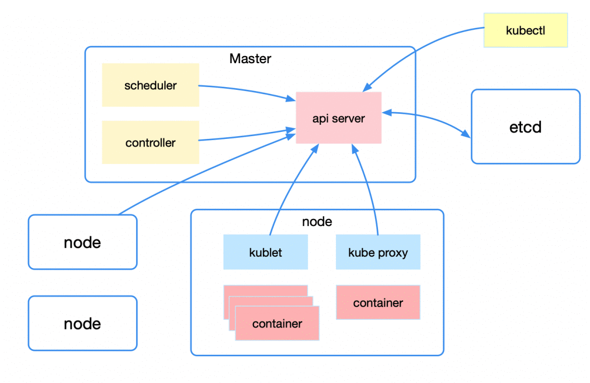

# k8s-cookbook

k8s是一个容器编排引擎
   
## Kubernetes 架构
   
   从宏观上来看 Kubernetes 的整体架构，包括 Master、Node 以及 Etcd。  
   Master 即主节点，负责控制整个 Kubernetes 集群，它包括 API Server、Scheduler、Controller 等组成部分，它们都需要和 Etcd 进行交互以存储数据.
   
   API Server：主要提供资源操作的统一入口，这样就屏蔽了与 Etcd 的直接交互。功能包括安全、注册与发现等。

   Scheduler：负责按照一定的调度规则将 Pod 调度到 Node 上。

   Controller：资源控制中心，确保资源处于预期的工作状态。
   
   Node 即工作节点，为整个集群提供计算力，是容器真正运行的地方，包括运行容器、kubelet、kube-proxy：
   
   kubelet：主要工作包括管理容器的生命周期、结合 cAdvisor 进行监控、健康检查以及定期上报节点状态。

   Kube-proxy：主要利用 service 提供集群内部的服务发现和负载均衡，同时监听 service/endpoints 变化并刷新负载均衡。
   
   
## 从创建 Deployment 开始
   
   步骤如下：
   1. 首先是 kubectl 发起一个创建 deployment 的请求。
   2. apiserver 接收到创建 deployment 请求，将相关资源写入 etcd；之后所有组件与 apiserver/etcd 的交互都是类似的。
   3. deployment controller list/watch 资源变化并发起创建 replicaSet 请求
   4. replicaSet controller list/watch 资源变化并发起创建 pod 请求。
   5. scheduler 检测到未绑定的 pod 资源，通过一系列匹配以及过滤选择合适的 node 进行绑定。
   6. kubelet 发现自己 node 上需创建新 pod，负责 pod 的创建及后续生命周期管理。
   7. kube-proxy 负责初始化 service 相关的资源，包括服务发现、负载均衡等网络规则。
   
 
[参考](https://cloud.tencent.com/developer/article/1663968)
