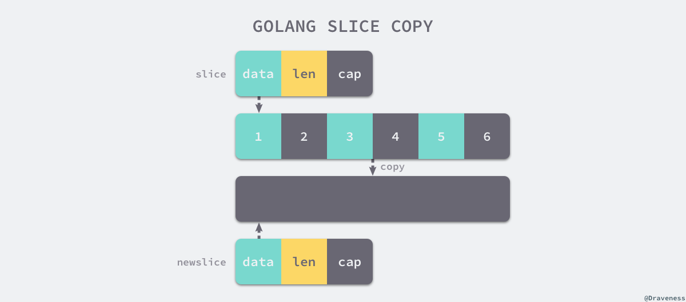
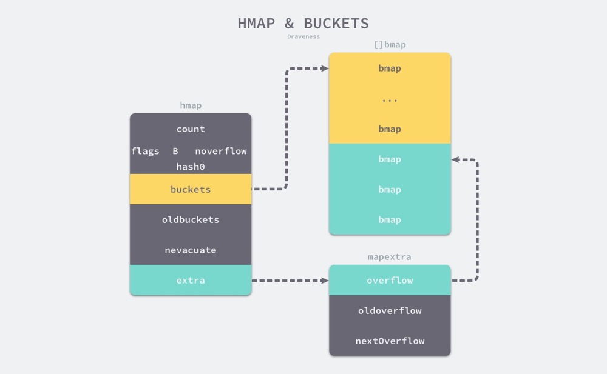
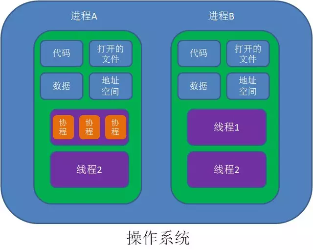
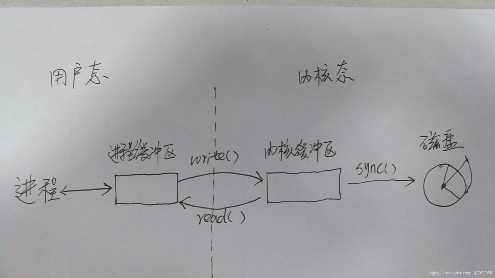
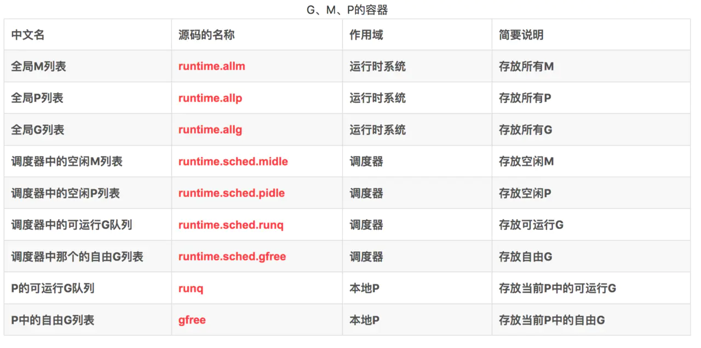

## Go语言基础

- [Go语言基础](#go语言基础)
  - [基本数据结构](#基本数据结构)
    - [array](#array)
    - [slice](#slice)
    - [map](#map)
    - [context](#context)
    - [channel](#channel)
    - [select](#select)
    - [defer](#defer)
    - [panic](#panic)
    - [interface](#interface)
    - [timer](#timer)
  - [调度器](#调度器)
  - [系统监控 sysmon](#系统监控-sysmon)
  - [内存模型](#内存模型)
  - [垃圾回收机制](#垃圾回收机制)
  - [内存优化](#内存优化)
  - [延伸阅读](#延伸阅读)

### 基本数据结构

#### array
1. 数据结构

   &Array{Elem: elem, Bound: bound}

#### slice
1. 数据结构

   编译期间的切片是 Slice 类型的，但是在运行时切片由如下的 SliceHeader 结构体表示，一个三元组结构。
   其中 Data 字段是指向数组的指针，Len 表示当前切片的长度，而 Cap 表示当前切片的容量，也就是 Data 数组的大小。
    ```
    type SliceHeader struct {
        Data uintptr
        Len  int
        Cap  int
    }
    ```
   Data 作为一个指针指向的数组是一片连续的内存空间，这片内存空间可以用于存储切片中保存的全部元素，
   数组中的元素只是逻辑上的概念，底层存储其实都是连续的，所以我们可以将切片理解成一片连续的内存空间加上长度与容量的标识。
   

2. 追加和扩容

   在分配内存空间之前需要先确定新的切片容量，Go 语言根据切片的当前容量选择不同的策略进行扩容：
   - 如果期望容量大于当前容量的两倍就会使用期望容量；
   - 如果当前切片的长度小于 1024 就会将容量翻倍；
   - 如果当前切片的长度大于 1024 就会每次增加 25% 的容量，直到新容量大于期望容量；

3. 拷贝切片

   当我们使用 copy(a, b) 的形式对切片进行拷贝时，编译期间的 cmd/compile/internal/gc.copyany 函数也会分两种情况进行处理，
   如果当前 copy 不是在运行时调用的，copy(a, b) 会被直接转换成下面的代码：
    ```
    n := len(a)
    if n > len(b) {
        n = len(b)
    }
    if a.ptr != b.ptr {
        memmove(a.ptr, b.ptr, n*sizeof(elem(a))) 
    }
    ```
   其中 memmove 会负责对内存进行拷贝，在其他情况下，编译器会使用 runtime.slicecopy 函数替换运行期间调用的 copy，例如：go copy(a, b)：
    ```
    func slicecopy(to, fm slice, width uintptr) int {
        if fm.len == 0 || to.len == 0 {
            return 0
        }
        n := fm.len
        if to.len < n {
            n = to.len
        }
        if width == 0 {
            return n
        }
        ...
    
        size := uintptr(n) * width
        if size == 1 {
            *(*byte)(to.array) = *(*byte)(fm.array)
        } else {
            memmove(to.array, fm.array, size)
        }
        return n
    }
    ```
   上述函数的实现非常直接，两种不同的拷贝方式一般都会通过 memmove 将整块内存中的内容拷贝到目标的内存区域中.
   
   相比于依次对元素进行拷贝，这种方式能够提供更好的性能，但是需要注意的是，哪怕使用 memmove 对内存成块进行拷贝，
   但是这个操作还是会占用非常多的资源，在大切片上执行拷贝操作时一定要注意性能影响。

4. 小结

   切片的很多功能都是在运行时实现的了，无论是初始化切片，还是对切片进行追加或扩容都需要运行时的支持，
   需要注意的是在遇到大切片扩容或者复制时可能会发生大规模的内存拷贝，一定要在使用时减少这种情况的发生避免对程序的性能造成影响。


[参考](https://draveness.me/golang/docs/part2-foundation/ch03-datastructure/golang-array-and-slice/)

#### map

1. 哈希表原理

   对key进行哈希，得到一个值，以该值为索引，在连续的内存区域内寻址存放value（一般以数组作为底层存储结构）。
   实现哈希表的关键点在于如何选择哈希函数，哈希函数的选择在很大程度上能够决定哈希表的读写性能。
   
   冲突解决：
   ```
   开放寻址法
   开放寻址法是一种在哈希表中解决哈希碰撞的方法，这种方法的核心思想是对数组中的元素依次探测和比较以判断目标键值对是否存在于哈希表中，
   如果我们使用开放寻址法来实现哈希表，那么在支撑哈希表的数据结构就是数组，不
   过因为数组的长度有限，存储 (author, draven) 这个键值对时会从如下哈希位置开始往下遍历，
   当我们向当前哈希表写入新的数据时发生了冲突，就会将键值对写入到下一个不为空的位置。
   ```
   
   ```
   拉链法(链地址法)
   与开放地址法相比，拉链法是哈希表中最常见的实现方法，大多数的编程语言都用拉链法实现哈希表，
   它的实现比较开放地址法稍微复杂一些，但是平均查找的长度也比较短，各个用于存储节点的内存都是动态申请的，可以节省比较多的存储空间。

   实现拉链法一般会使用数组加上链表，不过有一些语言会在拉链法的哈希中引入红黑树以优化性能，
   拉链法会使用链表数组作为哈希底层的数据结构，我们可以将它看成一个可以扩展的『二维数组』
   
   当我们需要将一个键值对 (Key, Value) 写入哈希表时，键值对中的键 Key 都会先经过一个哈希函数，哈希函数返回的哈希会帮助我们选择一个桶，
   和开放地址法一样，选择桶的方式就是直接对哈希返回的结果取模，
   选择了桶之后就可以遍历当前桶中的链表了，在遍历链表的过程中会遇到以下两种情况：
   
   找到键相同的键值对 —— 更新键对应的值；
   没有找到键相同的键值对 —— 在链表的末尾追加新键值对
   ```
   
2. 数据结构
   
   ```
   type hmap struct {
   	count     int
   	flags     uint8
   	B         uint8
   	noverflow uint16
   	hash0     uint32
   
   	buckets    unsafe.Pointer
   	oldbuckets unsafe.Pointer
   	nevacuate  uintptr
   
   	extra *mapextra
   }
   
   // count 表示当前哈希表中的元素数量；
   // B 表示当前哈希表持有的 buckets 数量，但是因为哈希表中桶的数量都 2 的倍数，所以该字段会存储对数，也就是 len(buckets) == 2^B；
   // hash0 是哈希的种子，它能为哈希函数的结果引入随机性，这个值在创建哈希表时确定，并在调用哈希函数时作为参数传入；
   // oldbuckets 是哈希在扩容时用于保存之前 buckets 的字段，它的大小是当前 buckets 的一半；
   
   
   // 桶的结构体 bmap 在 Go 语言源代码中的定义只包含一个简单的 tophash 字段，
   // tophash 存储了键的哈希的高 8 位，通过比较不同键的哈希的高 8 位可以减少访问键值对次数以提高性能
   type bmap struct {
   	tophash [bucketCnt]uint8
   }
   
   
   // 编译后结构体
   // bmap 结构体其实不止包含 tophash 字段，由于哈希表中可能存储不同类型的键值对并且 Go 语言也不支持泛型，
   // 所以键值对占据的内存空间大小只能在编译时进行推导，这些字段在运行时也都是通过计算内存地址的方式直接访问的，
   // 所以它的定义中就没有包含这些字段，但是我们能根据编译期间的 cmd/compile/internal/gc.bmap 函数对它的结构重建
   type bmap struct {
       topbits  [8]uint8
       keys     [8]keytype
       values   [8]valuetype
       pad      uintptr
       overflow uintptr
   }
   
   ```
   
   
3. 读写操作
    

4. 扩容

#### context


#### channel
   Channel 的实现是一个环形队列加上 mutex 锁的实现，一个发送方队列和一个接收方队列。

1. 底层结构
```
// src/runtime/chan.go
type hchan struct {
	qcount   uint           // 队列中的所有数据数
	dataqsiz uint           // 环形队列的大小
	buf      unsafe.Pointer // 指向大小为 dataqsiz 的数组
	elemsize uint16         // 元素大小
	closed   uint32         // 是否关闭
	elemtype *_type         // 元素类型
	sendx    uint           // 发送索引
	recvx    uint           // 接收索引
	recvq    waitq          // recv 等待列表，即（ <-ch ）
	sendq    waitq          // send 等待列表，即（ ch<- ）
	
    // lock protects all fields in hchan, as well as several
    // fields in sudogs blocked on this channel.
    //
    // Do not change another G's status while holding this lock
    // (in particular, do not ready a G), as this can deadlock
    // with stack shrinking.
    lock mutex
}
type waitq struct { // 等待队列 sudog 双向队列
	first *sudog
	last  *sudog
}

// src/runtime/runtime2.go
// sudogs are allocated from a special pool. Use acquireSudog and
// releaseSudog to allocate and free them.
type sudog struct {
	// The following fields are protected by the hchan.lock of the
	// channel this sudog is blocking on. shrinkstack depends on
	// this for sudogs involved in channel ops.

	g *g

	// isSelect indicates g is participating in a select, so
	// g.selectDone must be CAS'd to win the wake-up race.
	isSelect bool
	next     *sudog
	prev     *sudog
	elem     unsafe.Pointer // data element (may point to stack)

	// The following fields are never accessed concurrently.
	// For channels, waitlink is only accessed by g.
	// For semaphores, all fields (including the ones above)
	// are only accessed when holding a semaRoot lock.

	acquiretime int64
	releasetime int64
	ticket      uint32
	parent      *sudog // semaRoot binary tree
	waitlink    *sudog // g.waiting list or semaRoot
	waittail    *sudog // semaRoot
	c           *hchan // channel
}
```
   buf是缓存数据缓冲的环形队列，recvq sendq分别表示等待的读取和发送队列，对应的有recvx sendx表示各自的索引。
   
   lock用来保护当前hchan的所有fields，同时在持有锁的时候禁止改变其他g的状态，特别是ready其他g，这可能导致其他g被调度，然后发生栈收缩，导致死锁。
   ```
   发送数据过程中， 对要发送数据的指针进行读取，将会与调度器对执行栈的伸缩发生竞争。
   这是因为直接读取 Channel 的数据分为两个过程：1. 读取发送方的值的指针 2. 拷贝到要接收的位置。 
   然而在 1 和 2 这两个步骤之间，发送方的执行栈可能发生收缩，进而指针失效，成为竞争的源头。
   ```
   
   sudog保存着当前的g，以及要发送或者接收的数据。数据可能是指向栈空间的指针。
   
   makechan 实现的本质是根据需要创建的元素大小，对 mallocgc 进行封装，因此，Channel 总是在堆上进行分配，它们会被垃圾回收器进行回收， 
   这也是为什么 Channel 不一定总是需要调用 close(ch) 进行显式地关闭。
   
2. 发送数据
   如果一个 Channel 为零值（比如没有初始化），这时候的发送操作会暂止当前的Goroutine（gopark）。而 gopark会将当前的 Goroutine 休眠，从而发生死锁崩溃。
```
func chansend(c *hchan, ep unsafe.Pointer, block bool) bool {
	// 当向 nil channel 发送数据时，会调用 gopark
	// 而 gopark 会将当前的 Goroutine 休眠，从而发生死锁崩溃
	if c == nil {
		if !block {
			return false
		}
		gopark(nil, nil, waitReasonChanSendNilChan)
		throw("unreachable")
	}

	...
}
```

发送过程包含三个步骤：
```
1. 持有锁
2. 入队，拷贝要发送的数据
3. 释放锁

其中第二个步骤包含三个子步骤：
1. 找到是否有正在阻塞的接收方，是则直接发送
2. 找到是否有空余的缓存，是则存入
3. 阻塞直到被唤醒
```

3. 接收数据
   接收过程与发送过程类似
```
1. 上锁
2. 从缓存中出队，拷贝要接收的数据
3. 解锁

其中第二个步骤包含三个子步骤：
1. 如果 Channel 已被关闭，且 Channel 没有数据，立刻返回
2. 如果存在正在阻塞的发送方，说明缓存已满，从缓存队头取一个数据，再复始一个阻塞的发送方
3. 否则，检查缓存，如果缓存中仍有数据，则从缓存中读取，读取过程会将队列中的数据拷贝一份到接收方的执行栈中
4. 没有能接受的数据，阻塞当前的接收方 Goroutine
```
   无缓冲 Channel而言v <- ch happens before ch <- v了, 因为无缓冲Channel的接收方会先从发送方栈拷贝数据后，发送方才会被放回调度队列中，等待重新调度。

4. channel关闭
   当 Channel 关闭时，我们必须让所有阻塞的接收方重新被调度，让所有的发送方也重新被调度，
   这时候 的实现先将 Goroutine 统一添加到一个列表中（需要锁），然后逐个地进行复始（不需要锁）。


#### select

#### defer

#### panic

#### interface

#### timer

### 调度器

1. 进程、线程、协程
   
   进程就是应用程序的启动实例。比如我们运行一个游戏，打开一个软件，就是开启了一个进程。
   进程拥有代码和打开的文件资源、数据资源、独立的内存空间。
   文本区域存储处理器执行的代码，
   数据区域存储变量和进程执行期间使用的动态分配的内存，
   堆栈区域存储着活动过程调用的指令和本地变量。
   进程是抢占式的争夺CPU运行自身,而CPU单核的情况下同一时间只能执行一个进程的代码,但是多进程的实现则是通过CPU飞快的切换不同进程,因此使得看上去就像是多个进程在同时进行。
   通信问题:由于进程间是隔离的,各自拥有自己的内存内存资源, 因此相对于线程比较安全, 所以不同进程之间的数据只能通过 IPC(Inter-Process Communication) 进行通信共享。
   *进程是系统分配资源的最小单位*
   
   线程是操作系统调度时的最基本单元，而 Linux 在调度器并不区分进程和线程的调度，它们在不同操作系统上也有不同的实现，但是在大多数的实现中线程都属于进程。
   线程共享进程的内存地址空间，
   线程拥有自己的栈空间。
   通信问题：共享同样的地址空间，fd等资源，可通过全局变量通信；需注意并发时的线程安全；互斥锁。
   *线程是CPU调度的最小单位*
   
   *无论进程还是线程，都是由操作系统所管理的*
   
   *线程和进程的上下文切换*
   进程切换分3步:
   1. 切换页目录以使用新的地址空间
   2. 切换内核栈
   3. 切换硬件上下文
   
   而线程切换只需要第2、3步,因此进程的切换代价比较大。
   
   *协程切换*  
   1. CPU上下文切换（rip指令寄存器， rsp堆栈寄存器）
   
   协程是属于线程的。协程程序是在线程里面跑的。
   协程没有系统级别的上下文切换消耗，协程的调度切换是用户(程序员)手动切换的，需用户自己实现调度器以及协程上下文切换。
   相当于在一个线程持有的cpu时间片内，执行用户的多个计算任务，减少线程的频繁切换，因此更加灵活,因此又叫用户空间线程。
   基于上述特点，协程较适合与弱计算型、强IO型的应用（cpu占用时间短，io等待时间长）；结合select/epoll模型可实现较高的效率。
   
     *协程 线程对比*  
      1. 不需要切换内核态
      2. 协程的优势在于在单位时间片内，可以执行更多的程序调度。特别针对不需要内核态（无IO）参与的用户协程，cpu占用短，切换频繁的场景
      3. 大量线程的调度，需要耗费巨大的内核内存来维护，资源消耗大
   
    
   
   *用户态 内核态*  
   当发生用户态到内核态的切换时，会发生如下过程（本质上是从“用户程序”切换到“内核程序”）
   1. 设置处理器至内核态。
   2. 保存当前寄存器（栈指针、程序计数器、通用寄存器）。
   3. 将栈指针设置指向内核栈地址。
   4. 将程序计数器设置为一个事先约定的地址上，该地址上存放的是系统调用处理程序的起始地址。
   而之后从内核态返回用户态时，又会进行类似的工作。
   
   
   *I/O 频繁发生内核态和用户态切换，怎么解决*  
   首先要同意这个说法，即I/O会导致系统调用，从而导致内核态和用户态之间的切换。因为对I/O设备的操作是发生在内核态。
   那如何减少因为I/O导致的系统调用呢？答案是：使用户进程缓冲区。下面解释一下原因
   
   
   用户进程缓冲区  
   你看一些程序在读取文件时，会先申请一块内存数组，称为buffer，然后每次调用read，读取设定字节长度的数据，写入buffer。
   之后的程序都是从buffer中获取数据，当buffer使用完后，在进行下一次调用，填充buffer。
   所以说：用户缓冲区的目的就是是为了减少系统调用次数，从而降低操作系统在用户态与核心态切换所耗费的时间。除了在进程中设计缓冲区，内核也有自己的缓冲区。
   
   内核缓存区  
   当一个用户进程要从磁盘读取数据时，内核一般不直接读磁盘，而是将内核缓冲区中的数据复制到进程缓冲区中。
   但若是内核缓冲区中没有数据，内核会把对数据块的请求，加入到请求队列，然后把进程挂起，为其它进程提供服务。
   等到数据已经读取到内核缓冲区时，把内核缓冲区中的数据读取到用户进程中，才会通知进程，当然不同的IO模型，在调度和使用内核缓冲区的方式上有所不同。
   
    

2. Go调度模型
   
   G — 表示 Goroutine，它是一个待执行的任务。它在运行时调度器中的地位与线程在操作系统中差不多，但是它占用了更小的内存空间，也降低了上下文切换的开销。
   
   M — 表示操作系统的线程，它由操作系统的调度器调度和管理；本地缓存 mcache
   
   P — 表示处理器，它可以被看做运行在线程上的本地调度器；它存在的意义在于实现工作窃取（work stealing）算法，分散锁压力
   
   

3. 数据结构
    
   G
   Goroutine 在 Go 语言运行时使用私有结构体 runtime.g 表示。这个私有结构体非常复杂，总共包含 40 多个用于表示各种状态的成员变量，
   我们在这里也不会介绍全部字段，而是会挑选其中的一部分进行介绍
   ```
   type g struct {
   	stack       stack   // 描述了当前 Goroutine 的栈内存范围 [stack.lo, stack.hi)
   	stackguard0 uintptr // 用于调度器抢占式调度
      preempt       bool // 抢占信号
    	preemptStop   bool // 抢占时将状态修改成 `_Gpreempted`
    	preemptShrink bool // 在同步安全点收缩栈
   
      _panic       *_panic // 最内侧的 panic 结构体
   	_defer       *_defer // 最内侧的延迟函数结构体
   
      m              *m   // 当前 Goroutine 占用的线程，可能为空
      sched          gobuf    // 存储 Goroutine 的调度相关的数据
      atomicstatus   uint32   // Goroutine 的状态
      goid           int64    // Goroutine 的 ID，该字段对开发者不可见，Go 团队认为引入 ID 会让部分 Goroutine 变得更特殊，从而限制语言的并发能力
   }
   
   type gobuf struct {
        sp   uintptr    // 栈指针（Stack Pointer）
        pc   uintptr    // 程序计数器（Program Counter）
        g    guintptr   // 持有 runtime.gobuf 的 Goroutine
        ret  sys.Uintreg    // 系统调用的返回值
        ...
   }
   ```
   gobuf的内容会在调度器保存或者恢复上下文的时候用到，其中的栈指针和程序计数器会用来存储或者恢复寄存器中的值，改变程序即将执行的代码。
   结构体 runtime.g 的 atomicstatus 字段就存储了当前 Goroutine 的状态。除了几个已经不被使用的以及与 GC 相关的状态之外，Goroutine 可能处于以下 9 个状态
   ```
      _Gidle	刚刚被分配并且还没有被初始化
      _Grunnable	没有执行代码，没有栈的所有权，存储在运行队列中
      _Grunning	可以执行代码，拥有栈的所有权，被赋予了内核线程 M 和处理器 P
      _Gsyscall	正在执行系统调用，拥有栈的所有权，没有执行用户代码，被赋予了内核线程 M 但是不在运行队列上
      _Gwaiting	由于运行时而被阻塞，没有执行用户代码并且不在运行队列上，但是可能存在于 Channel 的等待队列上
      _Gdead	没有被使用，没有执行代码，可能有分配的栈
      _Gcopystack	栈正在被拷贝，没有执行代码，不在运行队列上
      _Gpreempted	由于抢占而被阻塞，没有执行用户代码并且不在运行队列上，等待唤醒
      _Gscan	GC 正在扫描栈空间，没有执行代码，可以与其他状态同时存在
   ```
   
   
   M
   
   Go 语言并发模型中的 M 是操作系统线程。调度器最多可以创建 10000 个线程，但是其中大多数的线程都不会执行用户代码（可能陷入系统调用），
   最多只会有 GOMAXPROCS 个活跃线程能够正常运行。
   
   在默认情况下，运行时会将 GOMAXPROCS 设置成当前机器的核数，我们也可以使用 runtime.GOMAXPROCS 来改变程序中最大的线程数。
   操作系统线程在 Go 语言中会使用私有结构体 runtime.m 来表示，这个结构体中也包含了几十个私有的字段，我们依然对其进行了删减，先来了解几个与 Goroutine 直接相关的字段：
   ```
    type m struct {
        // 其中 g0 是持有调度栈的 Goroutine，curg 是在当前线程上运行的用户 Goroutine，这也是操作系统线程唯一关心的两个 Goroutine
    	g0   *g 
    	curg *g
    	
        p             puintptr
        nextp         puintptr
        oldp          puintptr
    }
   ```

    g0 是一个运行时中比较特殊的 Goroutine，它会深度参与运行时的调度过程，包括 Goroutine 的创建、大内存分配和 CGO 函数的执行。在后面的小节中，
    我们会经常看到 g0 的身影。runtime.m 结构体中还存在着三个处理器字段，它们分别表示正在运行代码的处理器 p、暂存的处理器 nextp 和执行系统调用之前的使用线程的处理器 oldp
  
   P
   
   调度器中的处理器 P 是线程和 Goroutine 的中间层，它能提供线程需要的上下文环境，也会负责调度线程上的等待队列，通过处理器 P 的调度，每一个内核线程都能够执行多个 Goroutine，它能在 Goroutine 进行一些 I/O 操作时及时切换，提高线程的利用率。
   
   因为调度器在启动时就会创建 GOMAXPROCS 个处理器，所以 Go 语言程序的处理器数量一定会等于 GOMAXPROCS，这些处理器会绑定到不同的用户线程上并利用线程的计算资源运行 Goroutine。
   
   runtime.p 是处理器的运行时表示，作为调度器的内部实现，它包含的字段也非常多，其中包括与性能追踪、垃圾回收和计时器相关的字段，这些字段也非常重要，但是在这里就不一一展示了，我们主要关注处理器中的线程和运行队列：
   
   ```
   type p struct {
   	m           muintptr
   
   	runqhead uint32
   	runqtail uint32
   	runq     [256]guintptr
   	runnext guintptr
   	...

    状态	描述
    _Pidle	处理器没有运行用户代码或者调度器，被空闲队列或者改变其状态的结构持有，运行队列为空
    _Prunning	被线程 M 持有，并且正在执行用户代码或者调度器
    _Psyscall	没有执行用户代码，当前线程陷入系统调用
    _Pgcstop	被线程 M 持有，当前处理器由于垃圾回收被停止
    _Pdead	当前处理器已经不被使用
   }
   ```

   调度器sched
   
   调度器，所有 goroutine 被调度的核心，存放了调度器持有的全局资源，访问这些资源需要持有锁：
   管理了能够将 G 和 M 进行绑定的 M 队列
   管理了空闲的 P 链表（队列）
   管理了 G 的全局队列
   管理了可被复用的 G 的全局缓存
   管理了 defer 池
```
type schedt struct {
	lock mutex

	pidle      puintptr	// 空闲 p 链表
	npidle     uint32	// 空闲 p 数量
	nmspinning uint32	// 自旋状态的 M 的数量
	runq       gQueue	// 全局 runnable G 队列
	runqsize   int32
	gFree struct {		// 有效 dead G 的全局缓存.
		lock    mutex
		stack   gList	// 包含栈的 Gs
		noStack gList	// 没有栈的 Gs
		n       int32
	}
	sudoglock  mutex	// sudog 结构的集中缓存
	sudogcache *sudog
	deferlock  mutex	// 不同大小的有效的 defer 结构的池
	deferpool  [5]*_defer
	
	...
}
```
   
   
   MPG容器结构
   
   
   
4. 调度器启动

5. 协程创建与调度

6. 触发调度


### 系统监控 sysmon

1. 设计原理&启动
    
   Go 语言的系统监控起到了很重要的作用，它在内部启动了一个不会中止的循环，在循环的内部会轮询网络、抢占长期运行或者处于系统调用的 Goroutine 以及触发垃圾回收，
   通过这些行为，它能够让系统的运行状态变得更健康。
   

2. 循环监控

   检查死锁
   
   
   运行计时器
   
   运行网络轮训器 netpoll
   
   抢占处理器
   
   垃圾回收
   
3. 小结
    
   运行时通过系统监控来触发线程的抢占、网络的轮询和垃圾回收，保证 Go 语言运行时的可用性。
   系统监控能够很好地解决尾延迟的问题，减少调度器调度 Goroutine 的饥饿问题并保证计时器在尽可能准确的时间触发。

### 内存模型

   主要结构
   Go 的内存分配器主要包含以下几个核心组件：
   
   heapArena: 保留整个虚拟地址空间，对应与操作系统上的实际物理内存
   
   mheap：分配的堆，在页大小为 8KB 的粒度上进行管理
   
   mspan：是 mheap 上管理的一连串的页
   
   mcentral：收集了给定大小等级的所有 span
   
   mcache：为 per-P 的缓存
   
   
   
   mcache --> mcentral --> mheap
   
   ```
   // 说明
   heapArena堆区管理结构体
   mheap是最终管理内存分配落地的结构体，通过allspans []*mspan管理所有的mspan，每个mspan有一个uint8类型的字段spanclass标记大小等级与noscan，末位用于标记是否指针。
   内存管理中唯一的全局结构，维护全局的中心缓存列表 central，另一个是管理堆区内存区域arenas。

   所有mspan的分配最终落地到mheap.alloc方法，该方法会返回一个新的*mspan指针。
   mspan有也分配器进行管理，也分配器中的mspan在向系统申请内存时会新增sysAlloc
   
   runtime.mheap.sysAlloc 方法在最后会初始化一个新的 runtime.heapArena 结构体来管理刚刚申请的内存空间，该结构体会被加入页堆的二维矩阵中。
   
   
   mcentral特定大小等级的中心分配器，共有67*2个，在mheap中以central字段进行维护
    central       [numSpanClasses]struct {
    		mcentral mcentral
    		pad      [cpu.CacheLinePadSize - unsafe.Sizeof(mcentral{})%cpu.CacheLinePadSize]byte
    	}
    
   mcache通过alloc数组维护线程所需的内存分配，[numSpanClasses]*mspan 共 67*2=134个
   
   mcache特定大小的内存不足时向，通过加锁获取指定spanclass类型的mcentral对象，通过mcentral对象获取mspan, 并替换当前mspan, 替换前提：当前mspan无空闲内存，且新mspan有空闲内存。
   
   ```
   
   [结构体参考](https://changkun.de/golang/zh-cn/part2runtime/ch07alloc/basic/#heading)
   
   微对象 (0, 16B) — 先使用微型分配器，再依次尝试线程缓存、中心缓存和堆分配内存；
   
   小对象 [16B, 32KB] — 依次尝试使用线程缓存、中心缓存和堆分配内存；
   
   大对象 (32KB, +∞) — 直接在堆上分配内存；
   


[参考](https://draveness.me/golang/docs/part3-runtime/ch07-memory/golang-memory-allocator/)

### 垃圾回收机制

1. 垃圾回收统一理论
   所有的 GC 算法其存在形式可以归结为追踪（Tracing）和引用计数（Reference Counting）这两种形式的混合运用。
   
   追踪式 GC：从根对象出发，根据对象之间的引用信息，一步步推进直到扫描完毕整个堆并确定需要保留的对象，从而回收所有可回收的对象。
   
   引用计数式 GC：每个对象自身包含一个被引用的计数器，当计数器归零时自动得到回收。因为此方法缺陷较多，在追求高性能时通常不被应用。
   
   追踪式，分为多种不同类型，例如：
   
       标记清扫：从根对象出发，将确定存活的对象进行标记，并清扫可以回收的对象。
       
       标记整理：为了解决内存碎片问题而提出，在标记过程中，将对象尽可能整理到一块连续的内存上。
       
       增量式：将标记与清扫的过程分批执行，每次执行很小的部分，从而增量的推进垃圾回收，达到近似实时、几乎无停顿的目的。
       
       增量整理：在增量式的基础上，增加对对象的整理过程。
       
       分代式：将对象根据存活时间的长短进行分类，存活时间小于某个值的为年轻代，存活时间大于某个值的为老年代，永远不会参与回收的对象为永久代。并根据分代假设（如果一个对象存活时间不长则倾向于被回收，如果一个对象已经存活很长时间则倾向于存活更长时间）对对象进行回收。
       
   引用计数：根据对象自身的引用计数来回收，当引用计数归零时立即回收。
   
2. Go垃圾回收算法
   
   标记清扫法+混合写屏障。混合写屏障的引入是为了减少STW的时间，使赋值器、垃圾收集器可并行执行。
   
   三色标记法
   
       从垃圾回收器的视角来看，三色抽象规定了三种不同类型的对象，并用不同的颜色相称：
       白色对象（可能死亡）：未被回收器访问到的对象。在回收开始阶段，所有对象均为白色，当回收结束后，白色对象均不可达。
       灰色对象（波面）：已被回收器访问到的对象，但回收器需要对其中的一个或多个指针进行扫描，因为他们可能还指向白色对象。
       黑色对象（确定存活）：已被回收器访问到的对象，其中所有字段都已被扫描，黑色对象中任何一个指针都不可能直接指向白色对象。
        
   弱三色不变性
        
        垃圾回收器的正确性体现在：不应出现对象的丢失，也不应错误的回收还不需要回收的对象。 作为内存屏障的一种，写屏障（Write Barrier）是一个在并发垃圾回收器中才会出现的概念。
        当以下两个条件同时满足时会破坏垃圾回收器的正确性。
        条件 1: 赋值器修改对象图，导致某一黑色对象引用白色对象；
        条件 2: 从灰色对象出发，到达白色对象的、未经访问过的路径被赋值器破坏。
        
        只要能够避免其中任何一个条件，则不会出现对象丢失的情况，因为：
        如果条件 1 被避免，则所有白色对象均被灰色对象引用，没有白色对象会被遗漏；
        如果条件 2 被避免，即便白色对象的指针被写入到黑色对象中，但从灰色对象出发，总存在一条没有访问过的路径，从而找到到达白色对象的路径，白色对象最终不会被遗漏。
        
        黑色赋值器：已经由回收器扫描过，不会再次对其进行扫描。
        灰色赋值器：尚未被回收器扫描过，或尽管已经扫描过但仍需要重新扫描。
        
        弱三色不变性保证：
        黑色赋值器已经被回收器扫描过， 不会再对其进行任何扫描，一旦其分配新的白色对象 则意味着会导致错误的回收；新分配的对象为黑色。
        
   Go混合屏障技术
        
        灰色赋值器的 Dijkstra 插入屏障
        如果某一对象的引用被插入到已经被标记为黑色的对象中，这类屏障会保守地将其作为非白色存活对象， 以满足强三色不变性。
        写屏障会将被覆盖的指针和新指针都标记成灰色，而所有新创建的对象都会被直接标记成黑色。
        对于插入到黑色对象中的白色指针，无论其在未来是否会被赋值器删除，该屏障都会将其标记为可达（着色）。
        由于 Dijkstra 插入屏障的保守，在一次回收过程中可能会产生一部分被染黑的垃圾对象，只有在下一个回收过程中才会被回收。
        
        黑色赋值器的 Yuasa 删除屏障
        其思想是当赋值器从灰色或白色对象中删除白色指针时，通过写屏障将这一行为通知给并发执行的回收器。 这一过程很像是在操纵对象图之前对图进行了一次快照。
        果一个指针位于波面之前，则删除屏障会保守地将目标对象标记为非白色存活对象，进而避免条件 2 来满足弱三色不变性。
        具体来说，Yuasa 删除屏障 [Yuasa, 1990] 对于在回收过程中，对于被赋值器删除最后一个指向这个对象导致该对象不可达的情况， 仍将其对象进行着色。
[参考](https://changkun.de/golang/zh-cn/part1basic/ch04memory/barrier/)

3. 实现原理
    
    触发时机：
        
        runtime.sysmon runtime.forcegchelper 后台定时检查收集。
        运行时会在应用程序启动时在后台开启一个用于强制触发垃圾收集的 Goroutine，该 Goroutine 的职责非常简单 — 调用 runtime.gcStart 方法尝试启动新一轮的垃圾收集。
        该 Goroutine 会在循环中调用 runtime.goparkunlock 主动陷入休眠等待其他 Goroutine 的唤醒，
        runtime.forcegchelper 在大多数时间都是陷入休眠的，但是它会被系统监控器 runtime.sysmon 在满足垃圾收集条件时唤醒。
        系统监控在每个循环中都会主动构建一个 runtime.gcTrigger 并检查垃圾收集的触发条件是否满足，
        如果满足条件，系统监控会将 runtime.forcegc 状态中持有的 Goroutine 加入全局队列等待调度器的调度。
        
        runtime.GC 用户手动触发， 
        用户程序会通过 runtime.GC 函数在程序运行期间主动通知运行时执行，该方法在调用时会阻塞调用方知道当前垃圾收集循环完成，在垃圾收集期间也可能会通过 STW 暂停整个程序。
        
        runtime.mallocgc 申请内存时根据堆大小触发垃圾收集。
    
    垃圾收集启动
        
        垃圾收集在启动过程一定会调用 runtime.gcStart 函数，虽然该函数的实现比较复杂，
        但是它的主要职责就是修改全局的垃圾收集状态到 _GCmark 并做一些准备工作，我们会分以下几个阶段介绍该函数的实现：
        两次调用 runtime.gcTrigger.test 方法检查是否满足垃圾收集条件；
        暂停程序、在后台启动用于处理标记任务的工作 Goroutine、确定所有内存管理单元都被清理以及其他标记阶段开始前的准备工作；此时会STW
        进入标记阶段、准备后台的标记工作、根对象的标记工作以及微对象、恢复用户程序，进入并发扫描和标记阶段；
    
### 内存优化
1. 工具：pprof、trace

2. 逃逸分析 
    
   请记住这个： 栈分配廉价，堆分配昂贵  
   编译命令 go build -gcflags '-m' 会让编译器在编译时输出逃逸分析的结果。

   能引起变量逃逸到堆上的典型情况：

   发送指针或带有指针的值到 channel 中。在编译时，是没有办法知道哪个 goroutine 会在 channel 上接收数据。所以编译器没法知道变量什么时候才会被释放。

   在一个切片上存储指针或带指针的值。一个典型的例子就是 []*string 。这会导致切片的内容逃逸。尽管其后面的数组可能是在栈上分配的，但其引用的值一定是在堆上。

   slice 的背后数组被重新分配了，因为 append 时可能会超出其容量( cap )。 slice 初始化的地方在编译时是可以知道的，它最开始会在栈上分配。如果切片背后的存储要基于运行时的数据进行扩充，就会在堆上分配。

   在 interface 类型上调用方法。在 interface 类型上调用方法都是动态调度的 —— 方法的真正实现只能在运行时知道。想像一个 io.Reader 类型的变量 r , 调用 r.Read(b) 会使得 r 的值和切片 b 的背后存储都逃逸掉，所以会在堆上分配。

   以我们的经验，这四点是 Go 程序中最常见的导致堆分配的原因。幸运的是，是有解决办法的！下面我们深入几个具体例子说明，如何定位线上系统的内存性能问题。
   
3. 关于指针

   一个经验是： 指针指向的数据都是在堆上分配的。 因此，在程序中减少指针的运用可以减少堆分配。这不是绝对的，但是我们发现这是在实际问题中最常见的问题。
   
   一般情况下我们会这样认为： “值的拷贝是昂贵的，所以用一个指针来代替。”
   
4. 传递 Slice

   切片是造成低效内存分配行为的狂热区域。除非切片的大小在编译时就能知道，否则切片背后的数组(map也一样)会在堆上分配。
   
5. 小贴士
    
   不要过早优化，用数据来驱动我们的优化工作。  
   栈空间分配是廉价的，堆空间分配是昂贵的。  
   了解逃逸机制可以让我们写出更高效的代码。  
   指针的使用会导致栈分配更不可行。  
   找到在低效代码块中提供分配控制的api。  
   在调用频繁的地方慎用 interface。
   
6. 参考

   [逃逸分析](https://www.ctolib.com/topics-139052.html)
   
   [pprof](https://blog.golang.org/pprof)
   
   [工具](https://www.ctolib.com/topics-141214.html)

### 延伸阅读
[参考](https://draveness.me/golang/docs)

[参考](https://changkun.de/golang/zh-cn/part2runtime/ch07alloc/basic/#heading)

