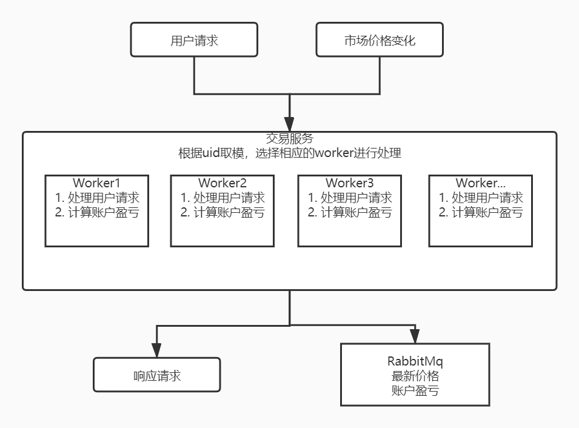

## 交易所

初期业务模型：市场报价制，价格不受自身平台用户的交易所影响。用户下价格委托单，价格达成机成交。

初期项目架构：bitcoin-kline(采集外部市场价)、trans-server(用户交易api)

项目核心组件：全局用户信息列表，[ncpu]*reqworker, 根据uid取模处理对应用户请求。
缺点：存在全局锁、热点数据、导致worker工作不均匀、并发性能低，有状态的内存计算型服务，中心化，无法水平扩展。


   
*TODO*  
改造成去中心化的分布式系统，可自由水平扩展。引入市场撮合机制。

1. 方案1
   
   用户unit存储在worker里面，每个worker串行处理用户请求。
   增加集群模式，水平扩展。
   在trans-service之前，加一层proxy，根据uid做hash，保证同一个uid只可能路由到下游某一台服务器，类似hash分片的概念。

   难点&缺点：集群可用性，某一台机器故障后，会导致需要全部机器reload，uid重新分片

2. 方案2  
   鉴于业务特点，用户成交不影响价格，所以用户之间是可并行的，单用户设计账户操作，不可并行。
   trans-server拆分成两个服务，一个调度服务，一个api-server服务。
   调度服务服务根据uid进行计算任务的分发，每个uid对应一个分布式锁。
   api-server计算处理单用户的数据。

   难点&缺点：调度服务需单节点，中心化。
   
   
### 应用特性

撮合机制，需存在两个匹配队列，买方队列、卖方队列。

数据库撮合：数据落地到数据库，每次撮合从数据库取出队列进行匹配。 
内存撮合：数据存于内存，记录日志，同时落地到数据库；撮合时从内存进行匹配。  

内存模型效率高，对数据库性能要求低。都存在单点串行问题，由撮合模式决定，同时只能有一个报价在进行撮合。
   
    
### 业内常用解决方案

采用内存撮合模型，同时通过分布式部署保证单点的高可用。


数据结构：优先队列
```go
type PriorityQueue interface {
	Put(item int)
	Pop() int
}

type PQueue struct {
	items []int
}

func (pq *PQueue) Put(item int) {
	// 1. append item to items
	// 2. swim items[length-1] and build max heap
	pq.items = append(pq.items, item)
	pq.swim(len(pq.items) - 1)
}

func pancakeSort(arr []int) []int {
	return sort(arr, len(arr))
}

func sort(arr []int, n int) []int {
	actions := make([]int, 0)
	if len(arr) <= 1 || n <= 1 {
		return actions
	}
	// find max
	maxIndex := 0
	max := arr[0]
	for i := 1; i < n; i++ {
		if arr[i] > max {
			max = arr[i]
			maxIndex = i
		}
	}
	// reverse max to first
	reverse(arr, 0, maxIndex)
	actions = append(actions, maxIndex+1)

	// reverse max to end
	reverse(arr, 0, n-1)
	actions = append(actions, n)

	actions = append(actions, sort(arr, n-1)...)

	return actions
}

func reverse(arr []int, i, j int) {
	for i < j {
		arr[i], arr[j] = arr[j], arr[i]
		i++
		j--
	}
}

func (pq *PQueue) swim(i int) {
	for {
		child := i
		root := i / 2
		if root >= 0 && pq.items[root] < pq.items[child] {
			// swap root child
			// make i == root
			pq.items[root], pq.items[child] = pq.items[child], pq.items[root]
			i = root
		}
		if i == child {
			break
		}
	}
}

func (pq *PQueue) Pop() int {
	// 1. swap items[0] items[length-1]
	// 2. pop items[length-1]
	// 3. sink item[0]
	n := len(pq.items)
	if n < 1 {
		return -1
	}

	pq.items[n-1], pq.items[0] = pq.items[0], pq.items[n-1]

	ans := pq.items[n-1]
	pq.items = pq.items[:n-1]

	pq.sink(0)
	return ans
}

func (pq *PQueue) sink(i int) {
	for {
		root := i
		left := 2*i + 1
		right := 2*i + 2
		if left < len(pq.items) && pq.items[root] < pq.items[left] {
			root = left
		}
		if right < len(pq.items) && pq.items[root] < pq.items[right] {
			root = right
		}
		if i == root {
			break
		}
		// root == max(left, right)
		// swap items[i] max(items[left], items[right]
		pq.items[i], pq.items[root] = pq.items[root], pq.items[i]
		// make i = max(left, right)
		i = root
	}
}

```

### 有状态分布式应用

采用raft协议的go实现[go-raft](https://github.com/hashicorp/raft)


### 具体实现

[trade-engine](https://github.com/xiaomLee/trade-engine)
   
