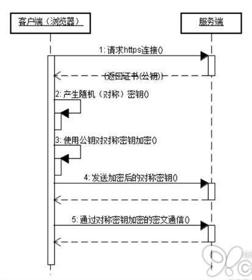

## http/https/tls协议

### http协议
   
超文本传输协议，基于请求与响应模式的、是一种无状态、无连接的一种应用层协议。
无连接指的是在 HTTP1.0 版本中，每次建立起的 TCP 连接只处理一个请求，服务端在收到客户端的应答之后就立即断开链接。
   
**HTTP方法**
GET    ------ 获取资源  
POST   ------ 传输资源  
PUT    ------ 更新资源  
DELETE ------ 删除资源  
HEAD   ------ 获取报文首部  
TRACE  ------ 请求服务器回送收到的请求信息，主要用于测试或诊断  
CONNECT------ 保留将来使用  
OPTIONS------ 请求查询服务器的性能，或者查询与资源相关的选项和需求  

**HTTP状态码**  
1xx: 指示信息   =》 表示请求已接收，继续处理  
2xx: 成功       =》 表示请求已成功接收  
3xx: 重定向     =》 要完成请求必须更进一步操作  
4xx: 客户端错误 =》 请求语法错误或者请求无法实现，比如路径错误，资源不存在等  
5xx: 服务器错误 =》 服务器未能实现合法的请求  
   
**常见的HTTP状态码**  
200 ok: 客户端请求成功。  
206 Partail Content： 客户发生了一个带有Range头的get请求，服务器完成了它（通常在请求大的视频或音频时可能出现）。  
301 Moved Permanently: 请求的页面已经转移至新的url地址。  
302 Found: 请求的页面已经临时转移至新的url地址。  
304 Not Modified: 客户端有缓存的文档并发送了一个有条件的请求，服务器告诉客户端原来的缓存文档该可以继续使用。  
400 Bad Request: 客户端语法错误。  
401 Unauthorized: 请求未经授权，这个状态码必须和WWW-Authenticate报头域一起使用。 
403 Forbidden: 页面禁止被访问   
404 Not Found: 请求资源不存在。  
500 Internal Sever Error: 服务器发生不可预期的错误，原来缓存的文档还可以继续被使用。  
503 Server Unavaliable: 请求未完成，服务器临时过载或当机，一段时间后可能恢复正常。  
  
**keepalive**  
TCP的KeepAlive和HTTP的Keep-Alive是完全不同的概念，不能混为一谈。实际上HTTP的KeepAlive写法是Keep-Alive，跟TCP的KeepAlive写法上也有不同。

tcp的keepalive是侧重在保持客户端和服务端的连接，一方会不定期发送心跳包给另一方，当一方端掉的时候，没有断掉的定时发送几次心跳包，
如果间隔发送几次，对方都返回的是RST，而不是ACK，那么就释放当前链接。
tcp连接默认时长连接，一般默认时2小时，可由系统配置更改。通过keepalive可实现真正的长连接。

TTP的keep-alive一般我们都会带上中间的横杠，普通的http连接是客户端连接上服务端，然后结束请求后，
由客户端或者服务端进行http连接的关闭。下次再发送请求的时候，客户端再发起一个连接，传送数据，关闭连接。
侧重于tcp的连接复用。

二者的作用简单来说：
HTTP协议的Keep-Alive意图在于短时间内连接复用，希望可以短时间内在同一个连接上进行多次请求/响应。

TCP的KeepAlive机制意图在于保活、心跳，检测连接错误。
当一个TCP连接两端长时间没有数据传输时(通常默认配置是2小时)，发送keepalive探针，探测链接是否存活。

[参考](https://juejin.im/post/6844903789703462925)  
[参考](https://www.jianshu.com/p/9fe2c140fa52)  

### https

https是在http的基础上+ssl(tls)实现的文本加密传输协议。

1. 浏览器将自己支持的一套加密规则发送给网站。

2. 网站从中选出一组加密算法与HASH算法，并将自己的身份信息以证书的形式发回给浏览器。证书里面包含了网站地址，加密公钥，以及证书的颁发机构等信息。

3. 浏览器获得网站证书之后浏览器要做以下工作：  
    a) 验证证书的合法性(颁发证书的机构是否合法，证书中包含的网站地址是否与正在访问的地址一致等)，如果证书受信任，则浏览器栏里面会显示一个小锁头，否则会给出证书不受信的提示。  
    b) 如果证书受信任，或者是用户接受了不受信的证书，浏览器会生成一串随机数的密码，并用证书中提供的公钥加密。  
    c) 使用约定好的HASH算法计算握手消息，并使用生成的随机数对消息进行加密，最后将之前生成的所有信息发送给网站。
    
4. 网站接收浏览器发来的数据之后要做以下的操作：  
    a) 使用自己的私钥将信息解密取出密码，使用密码解密浏览器发来的握手消息，并验证HASH是否与浏览器发来的一致。  
    b) 使用密码加密一段握手消息，发送给浏览器。

5. 浏览器解密并计算握手消息的HASH，如果与服务端发来的HASH一致，此时握手过程结束，之后所有的通信数据将由之前浏览器生成的随机密码并利用对称加密算法进行加密。