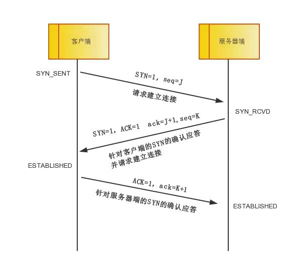
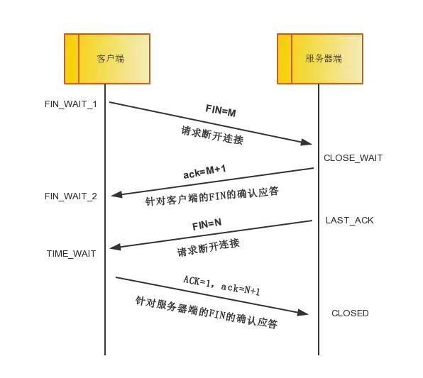

# TCP vs UDP

TCP 和 UDP 是 TCP/IP 协议簇里面具有代表性的**传输层协议**。
TCP 提供可靠的通信传输，UDP 则常被用于广播或通信细节需交由应用层控制的场景。

## OSI参考模型

通常网络的体系结构被划分为7层，每层之间都有相应的协议用于层与层的通信。
7层网络结构从上到下分别为：应用层、表示层、会话层、传输层、网络层(IP层)、数据链路层、物理层。

IP报文的首部中有一个协议字段，用于表示传输层所使用的的协议，TCP、UDP即通过该字段来区分。

TCP、UDP首部中用端口号来标识上层应用，包括源端口号、目标端口号。

IP首部 + TCP/UDP首部组成一个5元组(源IP、目标IP、协议、源端口、目标端口)，构成一个唯一通信标识符。

## TCP

### 连接管理

**三次握手**

第一次次握手：客户端将标志位SYN置为1，随机产生一个值seq=J，并将该数据包发送给服务器端，客户端进入SYN_SENT状态，等待服务器端确认。

第二次握手：服务器端收到数据包后由标志位SYN=1知道客户端请求建立连接，服务器端将标志位SYN和ACK都置为1，ack=J+1，随机产生一个值seq=K，
并将该数据包发送给客户端以确认连接请求，服务器端进入SYN_RCVD状态。

第三次握手：客户端收到确认后，检查ack是否为J+1，ACK是否为1，如果正确则将标志位ACK置为1，ack=K+1，
并将该数据包发送给服务器端，服务器端检查ack是否为K+1，ACK是否为1，如果正确则连接建立成功，客户端和服务器端进入ESTABLISHED状态，完成三次握手。随后客户端与服务器端之间可以开始传输数据了。

   
**四次挥手**

中断连接端可以是客户端，也可以是服务器端。

CLIENT SEND FIN -> CLIENT FIN_WAIT_1 -> SERVER RCV AND SNED ACK -> CLIENT FIN_WAIT_2
SERVER SEND FIN -> SERVER LAST_ACK -> CLIENT RCV AND SEND ACK -> TIME_WAIT

第一次挥手：客户端发送一个FIN=M，用来关闭客户端到服务器端的数据传送，客户端进入FIN_WAIT_1状态。
意思是说"我客户端没有数据要发给你了"，但是如果你服务器端还有数据没有发送完成，则不必急着关闭连接，可以继续发送数据。

第二次挥手：服务器端收到FIN后，先发送ack=M+1，告诉客户端，你的请求我收到了，但是我还没准备好，请继续你等我的消息。
这个时候客户端就进入FIN_WAIT_2 状态，继续等待服务器端的FIN报文。

第三次挥手：当服务器端确定数据已发送完成，则向客户端发送FIN=N报文，告诉客户端，好了，我这边数据发完了，准备好关闭连接了。
服务器端进入LAST_ACK状态。

第四次挥手：客户端收到FIN=N报文后，就知道可以关闭连接了，但是他还是不相信网络，怕服务器端不知道要关闭，
所以发送ack=N+1后进入TIME_WAIT状态，如果Server端没有收到ACK则可以重传。
服务器端收到ACK后，就知道可以断开连接了。客户端等待了2MSL后依然没有收到回复，则证明服务器端已正常关闭，那好，我客户端也可以关闭连接了。

最终完成了四次握手。


**time_wait问题**  
time_wait的存在是为了让对方准确收到最后一次ack。在高并发环境下，可能对导致系统可用socket不足的情况，无法为新到的请求分配端口。

解决方案
1. 设置系统参数，加快time_wait状态连接的回收
    ```
    vim /etc/sysctl.conf
    
    #time wait 最高的队列数
    tcp_max_tw_buckets = 256000
    
    #FIN_WAIT_2到TIME_WAIT的超时时间
    net.ipv4.tcp_fin_timeout = 30
    
    #表示开启重用
    net.ipv4.tcp_tw_reuse = 1 允许将TIME-WAIT sockets重新用于新的TCP连接，默认为0，表示关闭；
    
    #表示开启TCP连接中TIME-WAIT sockets的快速回收，默认为0，表示关闭
    net.ipv4.tcp_tw_recycle = 1
    ```
2. 使用长连接，比如grpc

[参考](https://developer.51cto.com/art/201906/597961.htm)

**案例应用**

[记一次 connection-reset-by-peer 问题定位](https://testerhome.com/articles/23296)

### 传输控制

**可靠性保证**

发送端的数据到达接收端时，接收端会返回一个确认应答(ACK)，ACK的内容为下一个发送数据的起始字节数。

当发送端发送完数据之后，等待一定时间(重发超时)后若还未收到ACK，则会进行重发。
此时存在接收端已接收，但确认应答丢失的可能，当重发收到相同数据时，接收端会主动进行丢弃。

每个TCP数据包首部都包含一个数据校验和，用于检验数据完整性。

**最大消息长度**

在建立 TCP 连接时，会确定发送数据包的单位，也即最大消息长度(Max Segment Size)。在建立连接的请求中，会在 TCP 首部中写入 MSS 选项，告诉对方所能适应的MSS 大小，之后会选择二者中较小的进行使用。
最理想的情况下，最大消息长度正好是IP中不糊被分片处理的最大数据长度，即MTU。
当应用层数据到达 TCP 传输层时，会对数据包按 MSS 进行分片发送，接收端接收之后，按序重组。

**窗口控制**

接收端会实现一个缓冲区，并把这个缓冲区大小通过 ACK 的 TCP 首部返回给发送端，发送端可连续发送该窗口大小的数据包，而不用等待确认应答的返回。
在滑动窗口机制下，不必每个发送都必须有 ACK，当一个更大的 ACK 到达时，前面的数据一定已经到达。
同时为了防止出现糊涂窗口综合征，减少小报文段的传输进一步提高网络利用率，还引入了延时应答、捎带应答等机制。

滑动窗口机制下，若某个数据包丢失，接收端对之后所有数据包的 ACK 应答中都会以丢失的那个数据包的序号为返回值，发送端在在收到某个确认应答之后，又连续3次收到重复的确认应答，则认为该数据包丢失，触发重发。该机制称为重发控制，比超时重发更为快速高效。

在确认应答的首部中会回发当前接收端缓冲区的剩余窗口大小，以此来控制发送端的发送速率，这被称为流量控制。
当返回的剩余大小为0时，发送端暂停数据发送，过了重发超时时间之后，若还未收到窗口更新同时，则会主动发送一个窗口探测的数据包，该数据包的确认应答中包含剩余窗口大小；此外接收端若有窗口更新，也会主动发送一个窗口更新通知给发送端。


**拥塞控制**

网络拥塞指的是某段时间，对网络中某一资源的需求超过了该资源所能提供的最大可用部分，导致整体网络性能变差，继而引发重传，加剧拥塞。

拥塞控制指的是对整个计算机网络中的传输链路进行数据流入控制的统称。
TCP 为了在一个共享的计算机网络中防止进入网络拥塞的状态，定义了一个拥塞窗口的概念，用于控制发送端所发送的数据量。
发送端的发送速率同时受到接收端滑动窗口的流量控制、与拥塞窗口的控制，取二者较小值。

慢启动：TCP 发送端在通信一开始时，拥塞窗口设置为1，此后每收到一个 ACK 窗口值就会以1/2/4的指数形式增长，直到达到慢启动阈值。

### TCP 协议缺陷

- 升级困难。整个 TCP 协议是在内核中实现的，协议升级需升级内核层，同时涉及到客户端、服务端。
- 建立连接、关闭连接耗时。每次连接都需三次握手。
- TCP 报文首部无法加密，存在伪造的安全问题。
- 存在队头阻塞。当中间某段报文丢失后，会阻塞后续所有报文传输，http2多路复用场景下体验尤其明显。
- 网络迁移需重新建立连接。网络切换时，需重走整个连接的建立过程、慢启动等。

## UDP

UDP 是 user datagram protocl 的缩写。这里的 user 更相当于程序员，即基于用户程序的数据传输协议，编程人员可对数据的传输过程进行精细控制。

不提供复杂的控制机制，利用 IP 提供面向无连接的通信服务，将应用层的数据直接直接转发。有如下特点：
- 面向无连接；
- 不负责重发；
- 不进行流量控制等行为以避免网络拥塞；
- 不保证顺序；
- 通信细节的控制交由应用层程序
- 简单高效。

常被用于一下场景：
- 数据包总量较少的通信(DNS、SNMP)；
- 音视频等多媒体通信——即时通信；
- LAN等局域网内通信；
- 广播、多播通信。

## QUIC

[基于 UDP 实现的可靠传输](https://www.cnblogs.com/xiaolincoding/p/16347800.html)

